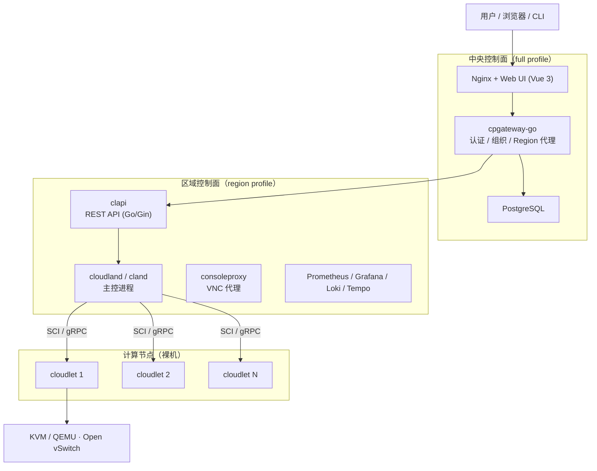

# CloudLand

> 轻量级 IaaS 云平台 —— 高性能、可自愈、极简运维
> Moved from https://github.com/IBM/cloudland

CloudLand 是一个轻量级的 **基础设施即服务 (IaaS)** 框架，用于管理虚拟机实例、软件定义网络 (SDN)、存储卷等云基础设施资源。得益于 HPC 领域的 SCI 通信框架，单集群可支持超过 **10,000 个 Hypervisor 节点**，适合作为大规模公有云的底座。

除内置的多租户能力外，CloudLand 也支持与第三方认证/授权系统对接，同样适用于私有云与超融合 (HCI) 场景。

## 核心特性

- **轻量架构** — 组件精简，控制面容器化交付，计算面裸机部署保留原生 IO 性能。
- **低学习门槛** — 开发与运维都能快速上手，部署仅需一条命令。
- **高性能消息** — 基于 SCI 的树形消息总线，内部消息投递快速可靠。
- **HPC 级扩展** — Hypervisor 按树形层级组织，agent 按需拉起，横向扩展能力强。
- **自愈稳定** — 自动故障恢复，支持 VRRP 主备高可用。
- **可观测性** — 内置 Prometheus / Grafana / Loki / Tempo 与 OpenTelemetry 全链路追踪。
- **高度可定制** — 易于扩展，便于实现自定义特性。

## 架构概览



更详细的架构说明见 [docs/architecture](docs/architecture/overview.md)。

## 仓库结构

| 目录 | 说明 |
| :--- | :--- |
| `api/` | Go 实现的 REST API (`clapi`)、Go 版 `cland` / `cloudlet`、告警规则管理服务 |
| `src/` | C++ 实现的控制面 `cloudland` 与计算节点代理 `cloudlet` |
| `sci/` | SCI 通信框架（HPC 消息总线），控制面与计算节点之间的传输层 |
| `cpgateway-go/` | Go 重写的中央网关：认证、组织管理、多 Region 代理 |
| `web/` | Vue 3 + TypeScript 管理控制台 |
| `docs/` | VitePress 文档站（指南 / 架构 / 部署 / API） |
| `deploy/` | Docker Compose 与 Ansible 部署编排、一键部署脚本 |
| `scripts/` | 计算节点后端脚本（KVM、网络、监控、计量） |
| `utils/` | VXLAN 相关工具（`vxarp`、`vxresolver`） |
| `tools/` | Python CLI 工具 `cloudland_cli` |

## 快速开始（单节点）

在一台 Ubuntu 24.04 / 26.04 控制节点上，以 root 身份执行：

```bash
export PUBLIC_IP=1.2.3.4                 # 浏览器访问使用的公网 IP
export INTERNAL_IP=192.168.1.100         # 管理网内网 IP
export NETWORK_DEVICE=eth0               # 主网卡名称
export MANAGEMENT_VIP=192.168.1.100      # 管理 VIP（单节点填 INTERNAL_IP）
export DB_LISTEN_IP=127.0.0.1

export POSTGRES_PASSWORD=your_db_password
export ADMIN_PASSWORD=your_admin_password
export ADMIN_EMAIL=admin@cloudland.local
export CPGATEWAY_SECRET_KEY=your_secret_key_change_me

# 全量单节点：中央控制面 + 区域控制面 + 本地数据库
export COMPOSE_PROFILES=full,dev,region

curl -sSL https://raw.githubusercontent.com/threen134/cloudland/staging/deploy/docker/scripts/deploy-control-node.sh | bash
```

`COMPOSE_PROFILES` 控制启用的组件：`region`（区域控制面与监控栈）、`region-gateway`（VNC WebSocket TLS 终端）、`full`（Nginx + cpgateway + Web UI）、`dev`（容器化 PostgreSQL）。

计算节点采用「先在 Web UI / API 注册，再在节点上执行返回的部署命令」的方式加入集群，详见 [添加计算节点](docs/deployment/04-compute-node.md)。

完整部署手册：[docs/deployment](docs/deployment/index.md)（前置要求、HA 部署、多 Region、配置参考、运维管理）。

## 本地开发

同时启动 Web UI 与文档站：

```bash
./dev.sh          # Web UI → http://localhost:5173，文档 → http://localhost:5174
```

单独构建各组件：

```bash
# REST API / Go 版 cland / cloudlet / 告警规则管理
cd api && make setup && make

# 中央网关
cd cpgateway-go && make

# C++ 控制面与计算节点代理（依赖已安装的 SCI）
cd sci && ./configure && make && sudo make install
cd src && make

# 管理控制台
cd web && npm install && npm run dev

# 文档站
cd docs && npm install && npm run docs:dev
```

运行测试：

```bash
cd api && make test
cd cpgateway-go && make test
```

## 文档

文档站源码位于 `docs/`，包含：

- [项目简介](docs/guide/introduction.md) 与 [快速上手](docs/guide/getting-started.md)
- 使用指南：[实例](docs/guide/instances.md)、[网络](docs/guide/networking.md)、[安全组](docs/guide/security-groups.md)、[负载均衡](docs/guide/load-balancers.md)、[存储卷](docs/guide/volumes.md)、[镜像](docs/guide/images.md)
- [架构解析](docs/architecture/overview.md) 与 [API 参考](docs/api/overview.md)

## 反馈问题

使用中遇到问题，请提交 [issue](https://github.com/threen134/cloudland/issues)。

## 许可证

Apache License 2.0，详见 [LICENSE](LICENSE)。
