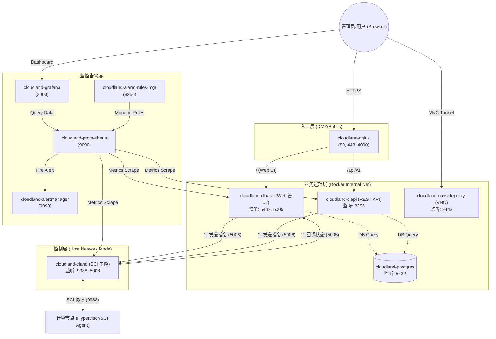

# 🚀 CloudLand Docker 部署指南

> **CloudLand** 是一款致力于“极致性能、轻量交付”的开源私有云平台。本方案通过 Docker 将控制面容器化，在保持计算面裸机性能的同时，极大简化了部署与运维流程。

---

## 📑 目录

- [🏗️ 架构概览](#🏗️-架构概览)
- [📋 前提条件](#📋-前提条件)
- [⚡ 快速开始](#⚡-快速开始)
- [⚙️ 配置说明](#⚙️-配置说明)
- [🖥️ 添加计算节点](#🖥️-添加计算节点)
- [📂 目录结构](#📂-目录结构)
- [🛠️ 运维命令](#🛠️-运维命令)
- [🔍 故障排查](#🔍-故障排查)

---

## 🏗️ 架构概览

本方案将 CloudLand **控制面**容器化，**计算面**保持裸机部署：

### 1. 核心流程架构图

此图描述了 CloudLand 容器化环境下各组件之间的网络通信与调用逻辑。



### 2. 核心调用说明

| 调用方 | 接收方 | 端口 | 协议类型 | 说明 |
| :--- | :--- | :--- | :--- | :--- |
| **User** | **Nginx** | 80/443 | HTTPS | Web 管理界面主要入口 |
| **Nginx** | **clbase** | 5443 | HTTP/HTTPS | 转发管理界面请求 |
| **Nginx** | **clapi** | 8255 | HTTP | 转发 RESTful API 请求 |
| **API 层** | **主控** | 5006 | gRPC/RPC | API 层向底层主控下发具体资源创建指令 |
| **主控** | **Web 层** | 5005 | gRPC/RPC | 主控执行完异步操作后（如 VM 创建完成）回调 Web 层 |
| **主控** | **Hyper 节点** | 9988 | SCI/Protobuf | 跨主机控制计算节点的 SCI 协议核心通信端口 |
| **User** | **ConsoleProxy**| 9443 | WebSockets | 虚拟机的 VNC 远程控制台流量 |
| **clbase/clapi** | **Postgres** | 5432 | SQL | 业务元数据存取 |
| **监控系统** | **被监控服务** | HTTP | HTTP | 定期抓取 `/metrics` 数据 |

### 3. 网络模式差异说明

> [!IMPORTANT]
> - **Host 网络模式 (`cloudland-cland`)**: 为了获取极高的网络性能以及直接通过物理网口发送 SCI 通信包，`cland` 容器不经过 Docker Bridge，直接占用宿主机的端口。
> - **Bridge 网络模式 (其他容器)**: 运行在 `cloudland-br` 虚拟网桥内，通过 Docker 的端口映射规则暴露给宿主机（或特定 IP）。

### 4. 服务安全与端口绑定建议

| 组件角色 | 建议绑定 IP | 核心作用说明 |
|----------|----------------|--------------|
| **nginx** | `PUBLIC_IP` | **系统唯一出口**，承载真实流量并进行 SSL 卸载。 |
| **consoleproxy** | `INTERNAL_IP` | **VNC 代理**，将宿主机流转换为 WebSockets。 |
| **clbase** | `INTERNAL_IP` | **管理核心**，处理所有 Web 管理逻辑。 |
| **clapi** | `INTERNAL_IP` | **API 端点**，为 SDK 和脚本提供可编程控制接口。 |
| **cloudland** | `Host Interface` | **南向控制通道**，维持与物理机 `cloudlet` 的长连接。 |
| **postgres** | `127.0.0.1` | **核心数据库**，存储租户、网络、资源等元数据。 |

> [!WARNING]
> 为了安全隔离，**仅 Nginx 的 80/443 端口建议暴露在公网**。
> 后端组件默认均监听在宿主机本地回环接口 (`127.0.0.1`) 或 `INTERNAL_IP`，可防止扫描攻击。

---

## 📋 前提条件

### 🕹️ 控制节点 (Control Node)
- **OS**: Linux (Ubuntu 24.04+ )
- **引擎**: Docker Engine 24.0+ & Docker Compose v2.20+
- **工具**: `gnutls-bin`, `openssl`, `curl`
- **配置**: 建议至少 4GB 内存，20GB 磁盘空间

### 💾 计算节点 (Compute Node)
- **OS**: Linux (Ubuntu 24.04+ )
- **虚拟化**: 必须支持 KVM (`/dev/kvm` 存在)
- **网络**: 与控制节点管理网互通

---

## ⚡ 快速开始

### 第一步：一键自动部署 (推荐)

如果您想在全新的环境中快速部署，只需在 bash 中运行以下命令：

```bash
# 1. 设置配置参数
export PUBLIC_IP=1.2.3.4                # 控制节点公网 IP
export INTERNAL_IP=192.168.1.100        # 管理网内网 IP
export NETWORK_DEVICE=eth0               # 管理网卡名
export MANAGEMENT_VIP=192.168.1.100      # 管理 VIP (单机填 INTERNAL_IP)
export DB_LISTEN_IP=127.0.0.1            # 数据库监听 IP
export POSTGRES_PASSWORD=your_db_password
export ADMIN_PASSWORD=your_admin_password

# 2. 执行一键部署脚本
curl -sSL https://raw.githubusercontent.com/threen134/cloudland/master/deploy/docker/scripts/deploy-control-node.sh | sudo -E bash
```

> [!TIP]
> **执行说明：**
> 1. 以上命令将自动完成：克隆代码、安装 Docker、配置网络、生成证书并启动容器。
> 2. **必须使用 `sudo -E`**：确保当前 Shell 的环境变量能传递给脚本执行环境。
> 3. **SSH 密钥**：脚本会自动在 `deploy/.ssh/` 下生成 CloudLand 所需的 `cland.key`。

### 第二步：检查与验证

部署完成后，通过 CLI 和浏览器验证各服务状态。

#### CLI 验证
```bash
# 检查容器状态
docker compose ps

# 检查实时日志 (Ctrl+C 退出)
docker compose logs -f

# 验证 Web 路由
curl -k https://localhost:443
```

#### 访问入口

| 服务 | URL | 默认凭据 |
|------|-----|---------|
| **Web 管理界面** | `https://<PUBLIC_IP>:443` | admin / `ADMIN_PASSWORD` |
| **REST API Swagger** | `https://<PUBLIC_IP>:443/api/v1/` | - |
| **Grafana 看板** | `http://<PUBLIC_IP>:3000` | admin / `GRAFANA_ADMIN_PASSWORD` |
| **Prometheus** | `http://<PUBLIC_IP>:9090` | - |

---

## ⚙️ 配置说明

### 1. 环境变量
所有配置通过 `.env` 文件管理，部署脚本会自动生成此文件，详见 [.env.example](.env.example)。

### 2. 自定义 config.toml
如需高级配置，可手动挂载 `config.toml`：
```bash
mkdir -p volumes/web
cp config/web/config.toml.example volumes/web/config.toml
vi volumes/web/config.toml
```
然后在 `docker-compose.yml` 中添加挂载：
```yaml
volumes:
  - ./volumes/web/config.toml:/opt/cloudland/web/conf/config.toml:ro
```

---

## 🖥️ 添加计算节点

计算节点需裸机部署，以下是添加步骤。

### 方法一：使用 Ansible (推荐)
1. 编辑 `deploy/hosts/hosts` 配置文件，添加节点 IP 及信息。
2. 更新 `deploy/docker/volumes/host.list` 列表。
3. 执行 Playbook：
   ```bash
   cd /opt/cloudland/deploy
   ansible-playbook -i hosts/hosts service.yml --tags hyper
   ```
4. 在控制节点重启主控服务：`docker compose restart cloudland`

### 方法二：手动部署 (脚本部署)
在物理计算节点上执行部署脚本。该脚本通过环境变量进行参数化配置：

| 环境变量 | 说明 | 默认值 |
| :--- | :--- | :--- |
| `CONTROLLER_IP` | 控制节点的 IP 地址 (**必填**) | `192.168.1.100` |
| `HOSTNAME` | 本节点的名称 | `hyper01` |
| `NETWORK_DEVICE` | 内部管理网卡名 | `eth0` |
| `SCI_CLIENT_ID` | 节点 ID，全局唯一且递增 | `0` |

#### 执行流程：
```bash
cd /opt/cloudland/deploy/docker/scripts
cp compute.env.example compute.env
vi compute.env  # 修改 CONTROLLER_IP 等
sudo bash deploy-compute-node.sh
```

> [!NOTE]
> **同机混部架构：**
> `deploy-compute-node.sh` 内置了“防冲突自愈机制”，即使与控制面在同一台机器上运行，也能智能修复防火墙规则。

---

## 📂 目录结构

```text
deploy/docker/
├── docker-compose.yml        # 核心 Docker 编排文件
├── .env                      # 部署生成的环境变量
├── dockerfiles/              # 镜像构建定义 (C++, Go)
├── scripts/                  # 运维脚本 (部署、证书、初始化)
├── config/                   # 服务静态配置 (Nginx, Prometheus)
└── volumes/                  # 运行时持久化数据 (数据库、证书、列表等)
    ├── certs/                # init-certs.sh 生成的 SSL 证书
    ├── host.list             # 被纳管的计算节点主机名列表
    └── pgdata/               # PostgreSQL 数据存储
```

---

## 🛠️ 运维命令

```bash
cd /opt/cloudland/deploy/docker

# ---------- 生命周期 ----------
docker compose up -d --build          # 重新构建并冷启动
docker compose down                   # 停止并清理容器
docker compose restart clbase         # 重启指定服务

# ---------- 数据运维 ----------
docker compose exec postgres psql -U postgres cloudland   # 进入数据库命令行
docker compose exec clbase /bin/sh                       # 进入后端容器
```

---

## 🔍 故障排查

### ❌ 容器启动失败
1. **查看日志**：`docker compose logs <service-name>`
2. **原因 1：证书未生成** — 执行 `bash scripts/init-certs.sh`。
3. **原因 2：端口占用** — 执行 `netstat -tlnp | grep <port>` 检查。

### ❌ 无法与计算节点通信
1. **网络模式**：确保 `cland` 运行在 `host` 模式下。
2. **端口监听**：检查控制节点 `9988` 端口是否开启 (`ss -tlnp`)。
3. **节点列表**：检查 `volumes/host.list` 是否包含该节点主机名。
4. **计算节点端**：检查 `scid` 和 `cloudlet` 服务是否正在运行。

### ❌ 数据库连接失败
- **健康检查**：`docker compose exec postgres pg_isready -U postgres`
- **密码验证**：确保 `.env` 中的 `POSTGRES_PASSWORD` 与容器环境一致。

---

> **Tip**: 如需更多支持，请访问 [CloudLand GitHub Repo](https://github.com/threen134/cloudland)。
