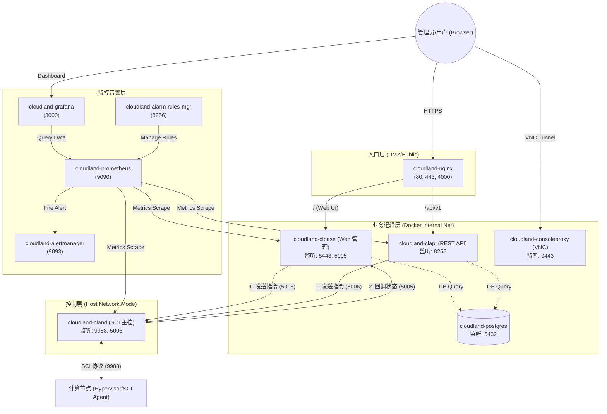

# CloudLand Docker 部署指南

> **CloudLand** 是一款致力于"极致性能、轻量交付"的开源私有云平台。
> 本方案通过 Docker 将控制面容器化，在保持计算面裸机性能的同时，极大简化了部署与运维流程。

## 目录

- [架构概览](#架构概览)
- [前提条件](#前提条件)
- [快速开始（单节点）](#快速开始单节点)
- [高可用 (HA) 部署](#高可用-ha-部署)
- [添加计算节点](#添加计算节点)
- [配置说明](#配置说明)
- [目录结构](#目录结构)
- [运维命令](#运维命令)
- [故障排查](#故障排查)

---

## 架构概览

本方案将 CloudLand **控制面**容器化，**计算面**保持裸机部署。

### 组件通信架构



### 核心调用说明

| 调用方 | 接收方 | 端口 | 协议 | 说明 |
| :--- | :--- | :--- | :--- | :--- |
| User | Nginx | 80/443 | HTTPS | Web 管理界面入口 |
| Nginx | clbase | 5443 | HTTP/HTTPS | 转发管理界面请求 |
| Nginx | clapi | 8255 | HTTP | 转发 RESTful API 请求 |
| API 层 | 主控 | 5006 | gRPC/RPC | 向主控下发资源创建指令 |
| 主控 | Web 层 | 5005 | gRPC/RPC | 异步操作完成后回调 Web 层 |
| 主控 | 计算节点 | 9988 | SCI/Protobuf | 跨主机 SCI 协议核心通信 |
| User | ConsoleProxy | 9443 | WebSockets | VNC 远程控制台 |
| clbase/clapi | Postgres | 5432 | SQL | 业务元数据存取 |
| 监控系统 | 被监控服务 | HTTP | HTTP | 定期抓取 `/metrics` |

### 网络模式说明

> [!IMPORTANT]
> - **Host 网络模式 (`cloudland-cland`)**：为了获取高网络性能及直接通过物理网口发送 SCI 通信包，`cland` 容器直接使用宿主机网络命名空间。
> - **Bridge 网络模式（其他容器）**：运行在 `cloudland-br` 虚拟网桥内，通过端口映射暴露服务。

### 端口绑定建议

| 组件 | 建议绑定 IP | 说明 |
|------|------------|------|
| nginx | `PUBLIC_IP` | 系统唯一出口，SSL 卸载 |
| consoleproxy | `INTERNAL_IP` | VNC WebSockets 代理 |
| clbase | `INTERNAL_IP` | Web 管理核心 |
| clapi | `INTERNAL_IP` | REST API 端点 |
| cloudland | Host Interface | SCI 南向控制通道 |
| postgres | `127.0.0.1` | 核心数据库 |

> [!WARNING]
> 为了安全隔离，**仅 Nginx 的 80/443 端口建议暴露在公网**。后端组件默认监听在 `127.0.0.1` 或 `INTERNAL_IP`。

---

## 前提条件

### 控制节点

- **OS**: Ubuntu 22.04+
- **引擎**: Docker Engine 24.0+ & Docker Compose v2.20+
- **工具**: `gnutls-bin`, `openssl`, `curl`
- **资源**: 至少 4GB 内存，20GB 磁盘

### 计算节点

- **OS**: Ubuntu 22.04+
- **虚拟化**: 必须支持 KVM（`/dev/kvm` 存在）
- **网络**: 与控制节点管理网互通

---

## 快速开始（单节点）

### 第一步：一键部署

```bash
# 设置配置参数
export PUBLIC_IP=1.2.3.4                # 控制节点公网 IP
export INTERNAL_IP=192.168.1.100        # 管理网内网 IP
export NETWORK_DEVICE=eth0               # 管理网卡名
export MANAGEMENT_VIP=192.168.1.100      # 管理 VIP（单机填 INTERNAL_IP）
export DB_LISTEN_IP=127.0.0.1            # 数据库监听 IP
export POSTGRES_PASSWORD=your_db_password
export ADMIN_PASSWORD=your_admin_password

# 执行一键部署
curl -sSL https://raw.githubusercontent.com/threen134/cloudland/master/deploy/docker/scripts/deploy-control-node.sh | sudo -E bash
```

> [!TIP]
> - 脚本将自动完成：克隆代码、安装 Docker、配置网络、生成证书并启动容器。
> - **必须使用 `sudo -E`** 以确保环境变量传递给脚本。
> - SSH 密钥会自动生成在 `deploy/.ssh/cland.key`。

### 第二步：验证

```bash
# 检查容器状态
docker compose ps

# 检查实时日志
docker compose logs -f

# 验证 Web 路由
curl -k https://localhost:443
```

**访问入口：**

| 服务 | URL | 默认凭据 |
|------|-----|---------|
| Web 管理界面 | `https://<PUBLIC_IP>:443` | admin / `ADMIN_PASSWORD` |
| REST API Swagger | `https://<PUBLIC_IP>:443/api/v1/` | - |
| Grafana 看板 | `http://<PUBLIC_IP>:3000` | admin / `GRAFANA_ADMIN_PASSWORD` |
| Prometheus | `http://<PUBLIC_IP>:9090` | - |

---

## 高可用 (HA) 部署

CloudLand 支持双控制节点 Active/Standby 模式，通过 VRRP (Keepalived) 管理 VIP 漂移，实现控制面自动故障切换。

### 架构

```
┌─────────────────┐          ┌─────────────────┐
│  控制节点 A      │          │  控制节点 B      │
│  (MASTER)       │          │  (BACKUP)       │
│                 │          │                 │
│  Keepalived ────┼── VRRP ──┼── Keepalived    │
│  Docker 容器组   │          │  Docker 容器组   │
│  (运行中)       │          │  (已停止)       │
└───────┬─────────┘          └───────┬─────────┘
        │                            │
        └──── MANAGEMENT_VIP ────────┘
                    │
           ┌───────┴───────┐
           │  外部 PostgreSQL │
           └───────────────┘
```

**故障切换流程：**

1. MASTER 宕机 → Keepalived 检测失败（~3s）
2. VIP 漂移到 BACKUP → `ha-notify.sh` 执行 `docker compose start`
3. 计算节点 SCI 自动重连到 MANAGEMENT_VIP:9988
4. 原 MASTER 恢复后变为 BACKUP（nopreempt 模式，VIP 不回切）

### 前提条件

- **两台控制节点**：硬件配置相同，网络互通
- **外部 PostgreSQL**：两台节点连接同一个数据库实例（不使用本地 postgres 容器）
- **root SSH 免密**：两台节点之间已配置双向 root SSH 免密登录
- 其余要求与单节点相同

### 部署步骤

#### 0. 准备 SSH 免密

在两台控制节点上分别执行：

```bash
# 生成密钥（如果没有）
ssh-keygen -t rsa -N '' -f /root/.ssh/id_rsa

# 节点 A → 节点 B
ssh-copy-id root@<节点B_IP>

# 节点 B → 节点 A
ssh-copy-id root@<节点A_IP>
```

#### 1. 部署 MASTER 节点

```bash
export HA_ROLE=MASTER
export PUBLIC_IP=1.2.3.4
export INTERNAL_IP=10.0.0.5
export MANAGEMENT_VIP=10.0.0.100
export PEER_IP=10.0.0.6                   # 对端 BACKUP IP
export NETWORK_DEVICE=eth0
export VRRP_INTERFACE=eth0
export DB_HOST=10.0.0.200                 # 外部数据库地址
export ADMIN_PASSWORD=your_admin_password

sudo -E bash deploy/docker/scripts/deploy-ha-node.sh
```

#### 2. 部署 BACKUP 节点

```bash
export HA_ROLE=BACKUP
export PUBLIC_IP=1.2.3.4                  # 与 MASTER 相同
export INTERNAL_IP=10.0.0.6
export MANAGEMENT_VIP=10.0.0.100          # 与 MASTER 相同
export PEER_IP=10.0.0.5                   # 对端 MASTER IP
export NETWORK_DEVICE=eth0
export VRRP_INTERFACE=eth0
export DB_HOST=10.0.0.200                 # 同一个外部数据库
export ADMIN_PASSWORD=your_admin_password

sudo -E bash deploy/docker/scripts/deploy-ha-node.sh
```

> [!NOTE]
> BACKUP 节点部署时会自动从 MASTER 同步 SSH 密钥和 TLS 证书，然后创建容器并停止，等待 Keepalived 切换时启动。

#### 3. 验证

```bash
# 检查 Keepalived 和 VIP
systemctl status keepalived
ip addr show eth0 | grep 10.0.0.100

# 检查服务状态（MASTER: running，BACKUP: stopped）
cd /opt/cloudland/deploy/docker && docker compose ps

# 模拟故障切换（在 MASTER 上执行）
sudo systemctl stop keepalived
# → 在 BACKUP 上验证 VIP 已漂移、容器自动启动
```

### 可选配置

| 变量 | 默认值 | 说明 |
|------|--------|------|
| `VRRP_ROUTER_ID` | `51` | VRRP 实例 ID，同网段多实例时需不同 |
| `VRRP_AUTH_PASS` | `cloudland` | VRRP 认证密码，两节点必须一致 |
| `VRRP_VIP_MASK` | `24` | VIP 子网掩码 |
| `DB_PORT` | `5432` | 外部数据库端口 |

### 计算节点 HA 配置

HA 模式下需开启 SCI 自动重连，以便主控切换后计算节点自动重连新 MASTER：

```bash
export SCI_ENABLE_FAILOVER=yes
# ... 其他计算节点环境变量 ...
sudo -E bash deploy/docker/scripts/deploy-compute-node.sh
```

### HA 运维

```bash
# Keepalived 日志
journalctl -u keepalived -f

# HA 部署日志
ls /var/log/cloudland-ha-deploy-*.log

# host.list 同步状态
cat /etc/cron.d/cloudland-ha-sync          # MASTER: 存在
cat /etc/cron.d/cloudland-ha-sync.disabled  # BACKUP: 已禁用

# 手动 VIP 回切（nopreempt 模式）
sudo systemctl stop keepalived             # 在当前 MASTER 上执行
sudo systemctl restart keepalived          # 在目标节点上执行
```

### 已知限制

- 外部 DB 必须预先准备好，两台控制节点连接同一个 PostgreSQL 实例
- host.list 同步延迟：cron 每分钟同步，极端情况下切换时可能丢失最近新增的计算节点
- nopreempt 模式下故障恢复后 VIP 不自动回切，需手动干预
- Prometheus 告警规则未同步，切换后需手动重建

---

## 添加计算节点

计算节点需裸机部署。

### 方法一：Ansible（推荐）

```bash
# 1. 编辑节点清单
vi deploy/hosts/hosts

# 2. 更新计算节点列表
vi deploy/docker/volumes/host.list

# 3. 执行 Playbook
cd /opt/cloudland/deploy
ansible-playbook -i hosts/hosts service.yml --tags hyper

# 4. 重启主控服务
cd /opt/cloudland/deploy/docker && docker compose restart cloudland
```

### 方法二：脚本部署

| 环境变量 | 说明 | 默认值 |
| :--- | :--- | :--- |
| `CONTROLLER_IP` | 控制节点 IP（**必填**） | `192.168.1.100` |
| `HOSTNAME` | 本节点名称 | `hyper01` |
| `NETWORK_DEVICE` | 管理网卡名 | `eth0` |
| `SCI_CLIENT_ID` | 节点 ID，全局唯一递增 | `0` |
| `SCI_ENABLE_FAILOVER` | HA 模式设为 `yes` | `no` |

```bash
cd /opt/cloudland/deploy/docker/scripts
cp compute.env.example compute.env
vi compute.env   # 修改 CONTROLLER_IP 等
sudo bash deploy-compute-node.sh
```

> [!NOTE]
> `deploy-compute-node.sh` 内置防冲突自愈机制，支持与控制面同机混部。

---

## 配置说明

### 环境变量

所有配置通过 `.env` 文件管理，部署脚本自动生成。模板参见 [.env.example](.env.example)。

### 自定义 config.toml

如需高级配置：

```bash
mkdir -p volumes/web
cp config/web/config.toml.example volumes/web/config.toml
vi volumes/web/config.toml
```

在 `docker-compose.yml` 中添加挂载：

```yaml
volumes:
  - ./volumes/web/config.toml:/opt/cloudland/web/conf/config.toml:ro
```

---

## 目录结构

```text
deploy/docker/
├── docker-compose.yml              # Docker 编排文件
├── .env.example                    # 环境变量模板（含 HA 配置项）
├── dockerfiles/                    # 镜像构建定义
├── scripts/
│   ├── deploy-control-node.sh      # 单节点控制面部署
│   ├── deploy-ha-node.sh           # HA 双节点部署
│   ├── deploy-compute-node.sh      # 计算节点部署
│   ├── ha-notify.sh                # Keepalived 状态切换回调
│   ├── init-certs.sh               # SSL 证书生成
│   └── web-entrypoint.sh           # Web 容器入口（含 DB 就绪探测）
├── config/
│   ├── nginx/                      # Nginx 反向代理配置
│   ├── prometheus/                 # Prometheus 监控配置
│   ├── alertmanager/               # Alertmanager 告警配置
│   └── keepalived/                 # Keepalived 配置模板 (HA)
│       └── keepalived.conf.template
└── volumes/                        # 运行时持久化数据
    ├── certs/                      # SSL 证书
    ├── host.list                   # 计算节点主机名列表
    └── alertmanager/               # Alertmanager 数据
```

---

## 运维命令

```bash
cd /opt/cloudland/deploy/docker

# 生命周期
docker compose up -d --build          # 重建并启动
docker compose down                   # 停止并清理
docker compose restart clbase         # 重启指定服务

# 数据运维
docker compose exec postgres psql -U postgres cloudland   # 数据库命令行（仅 dev 模式）
docker compose exec clbase /bin/sh                       # 进入后端容器

# 部署日志
ls /var/log/cloudland-*-deploy-*.log
# 控制节点: /var/log/cloudland-control-deploy-YYYYMMDD-HHMMSS.log
# HA 节点:  /var/log/cloudland-ha-deploy-YYYYMMDD-HHMMSS.log
# 计算节点: /var/log/cloudland-compute-deploy-YYYYMMDD-HHMMSS.log
```

---

## 故障排查

### 容器启动失败

1. 查看日志：`docker compose logs <service-name>`
2. 证书未生成：执行 `bash scripts/init-certs.sh`
3. 端口占用：`netstat -tlnp | grep <port>`

### 无法与计算节点通信

1. 确认 `cland` 运行在 `host` 网络模式
2. 检查 `9988` 端口：`ss -tlnp | grep 9988`
3. 检查 `volumes/host.list` 包含目标节点
4. 检查计算节点 `scid` 和 `cloudlet` 服务状态

### 数据库连接失败

- **单节点 (dev)**：`docker compose exec postgres pg_isready -U postgres`
- **HA 模式**：确认外部 DB 可达 `(echo > /dev/tcp/<DB_HOST>/5432) 2>/dev/null && echo OK`
- 确保 `.env` 中 `POSTGRES_PASSWORD` 与数据库一致
- clbase/clapi 启动时探测数据库 30 次（间隔 2s），60 秒不可达则退出。查看日志：`docker compose logs clbase`

### HA 故障切换不生效

1. Keepalived 状态：`systemctl status keepalived`
2. VIP 是否漂移：`ip addr show <VRRP_INTERFACE> | grep <MANAGEMENT_VIP>`
3. 回调脚本权限：`chmod +x scripts/ha-notify.sh`
4. 容器是否启动：`docker compose ps`，手动测试 `docker compose start`
5. 日志：`journalctl -u keepalived -f`

### HA SSH 检查失败

- 验证免密登录：`ssh -o BatchMode=yes root@<对端IP> true`
- 失败则执行 `ssh-keygen` 和 `ssh-copy-id` 后重新部署

---

> 如需更多支持，请访问 [CloudLand GitHub Repo](https://github.com/threen134/cloudland)。
