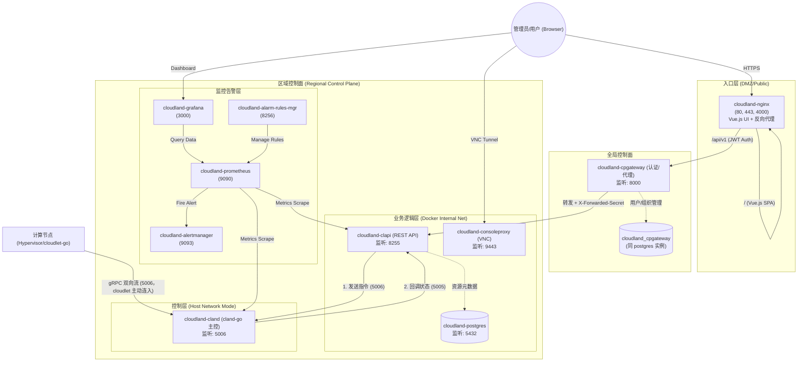

# CloudLand Docker 部署指南

> **CloudLand** 是一款致力于"极致性能、轻量交付"的开源私有云平台。
> 本方案通过 Docker 将控制面容器化，在保持计算面裸机性能的同时，极大简化了部署与运维流程。

## 目录

- [架构概览](#架构概览)
- [前提条件](#前提条件)
- [快速开始（单节点）](#快速开始单节点)
- [高可用 (HA) 部署](#高可用-ha-部署)
- [添加计算节点](#添加计算节点)
- [配置说明](#配置说明)
- [目录结构](#目录结构)
- [运维命令](#运维命令)
- [链路追踪](#链路追踪)
- [故障排查](#故障排查)

---

## 架构概览

本方案将 CloudLand **区域控制面**容器化，**计算面**保持裸机部署。

**架构说明**：
- **Control Plane Gateway (cpgateway)**：API 统一入口，负责认证、多租户管理、Region 管理
- **区域控制面**：每个 Region 独立部署一套，包含以下组件：
  | 组件 | 容器名 | 端口 | 职责 |
  |------|--------|------|------|
  | cloudland (cland) | `cloudland-cland` | 5006 | cland-go 主控（gRPC），南向控制计算节点 |
  | clapi | `cloudland-clapi` | 8255 | REST API，资源元数据管理 |
  | consoleproxy | `cloudland-consoleproxy` | 9443 | VNC 远程控制台代理 |
  | prometheus | `cloudland-prometheus` | 9090 | 监控指标采集 |
  | grafana | `cloudland-grafana` | 3000 | 监控可视化看板 |
  | alertmanager | `cloudland-alertmanager` | 9093 | 告警管理 |
  | alarm-rules-mgr | `cloudland-alarm-rules-mgr` | 8256 | 告警规则管理 |
- cpgateway 通过 Region 模型管理一个或多个区域控制面

### 组件通信架构



### 核心调用说明

| 调用方 | 接收方 | 端口 | 协议 | 说明 |
| :--- | :--- | :--- | :--- | :--- |
| User | Nginx | 80/443 | HTTPS | Web 管理界面入口（Vue.js SPA） |
| Nginx | cpgateway | 8000 | HTTP | 转发 API 请求（JWT 认证） |
| cpgateway | clapi | 8255 | HTTP | 内部代理（携带 X-Forwarded-Secret） |
| API 层 | 主控 | 5006 | gRPC | 向主控下发指令（`GRPC_AUTH_TOKEN` 鉴权） |
| 主控 | API 层 | 5005 | HTTP | 脚本回调、计算节点合法性校验（内部端口） |
| 计算节点 | 主控 | 5006 | gRPC | cloudlet-go 主动连入，接收命令、回传结果与健康上报（令牌 + 会话） |
| User | ConsoleProxy | 9443 | WebSockets | VNC 远程控制台 |
| clapi | postgres | 5432 | SQL | 资源元数据存取 |
| cpgateway | postgres | 5432 | SQL | 用户/组织/Region 管理 |
| 监控系统 | 被监控服务 | HTTP | HTTP | 定期抓取 `/metrics`（不含 consoleproxy） |

### 网络模式说明

> [!IMPORTANT]
> - **Host 网络模式 (`cloudland-cland`)**：计算节点经 `MANAGEMENT_VIP:5006` 直连 cland-go，`cland` 容器直接使用宿主机网络命名空间，HA 切换后 VIP 漂移到新 MASTER 即可被连入。
> - **Bridge 网络模式（其他容器）**：运行在 `cloudland-br` 虚拟网桥内，通过端口映射暴露服务。

### 端口绑定建议

| 组件 | 建议绑定 IP | 说明 |
|------|------------|------|
| nginx | `PUBLIC_IP` | 系统唯一出口，SSL 卸载，服务 Vue.js UI |
| consoleproxy | `INTERNAL_IP` | VNC WebSockets 代理 |
| cpgateway | `INTERNAL_IP` | 认证/代理中间层（仅 full 模式） |
| clapi | `INTERNAL_IP` | REST API 端点（内部访问） |
| otel-collector | 全部地址（`TELEMETRY_LISTEN_IP`） | 链路追踪 OTLP 接收端口 4317；计算节点 cloudlet 经 `MANAGEMENT_VIP` 导出（HA 下 VIP 漂移），无鉴权，依赖内网隔离 |
| tempo | `INTERNAL_IP` | 链路查询 API 3200（中央 Grafana 查询远程 Region 时使用） |
| loki | 全部地址（`TELEMETRY_LISTEN_IP`） | 日志写入 3100；计算节点 promtail-agent 经 `MANAGEMENT_VIP` 推送（HA 下 VIP 漂移），无鉴权，依赖内网隔离 |
| cloudland | 全部地址（`GRPC_LISTEN`） | gRPC 南向控制通道；计算节点经 `MANAGEMENT_VIP` 连入（HA 下 VIP 漂移），依赖 `GRPC_AUTH_TOKEN` 鉴权 |
| postgres | `127.0.0.1` | 核心数据库 |

> [!WARNING]
> 为了安全隔离，**仅 Nginx 的 80/443 端口建议暴露在公网**。后端组件默认监听在 `127.0.0.1` 或 `INTERNAL_IP`；cloudland 5006、loki 3100、otel-collector 4317 因计算节点经 `MANAGEMENT_VIP` 连入而默认监听全部地址，部署脚本不限制来源，必须由安全组/外部防火墙禁止公网访问。
>
> **重要**: clapi 不应直接暴露到公网，所有外部 API 请求必须通过 cpgateway进行认证和代理。

### 部署模式说明

CloudLand Docker 部署支持三种模式，通过 `COMPOSE_PROFILES` 环境变量控制：

| 模式 | COMPOSE_PROFILES | 组件 | 适用场景 |
|------|-----------------|------|---------|
| **仅区域控制面** | `region` | cloudland + clapi + consoleproxy + 监控 | 远程 Region 节点，连接外部数据库，无 UI，无认证 |
| **区域控制面 + 本地 DB** | `dev,region` | 区域控制面 + cpgateway + 本地 postgres | 单机开发测试（含认证层） |
| **完整模式** | `full,region` | 区域控制面 + cpgateway + nginx + Vue.js UI | 生产环境（外部 DB），HA 部署 |
| **完整单节点** | `full,dev,region` | 完整模式 + 本地 postgres | 单机完整体验（推荐） |
| **仅中央控制面** | `full,dev` | cpgateway + nginx + Vue.js UI + 本地 postgres | 多 Region 架构的中央节点 |

> 需要内置 MinIO 镜像仓库时，在上述组合后追加 `minio`。

**架构差异**:

```
# 仅区域控制面模式（无 UI，无 cpgateway）
User → clapi (直接访问，无认证) → cloudland → 计算节点

# 开发模式（有 cpgateway 统一入口，无 UI）
User → cpgateway (JWT 认证) → clapi → cloudland → 计算节点

# 完整模式（有 UI + cpgateway 统一入口）
User → nginx (Vue.js) → cpgateway (JWT 认证) → clapi → cloudland → 计算节点
```

---

## 前提条件

### 控制节点

- **OS**: Ubuntu 24.04 LTS 或 Ubuntu 26.04 LTS
- **引擎**: Docker Engine 24.0+ & Docker Compose v2.20+
- **工具**: `gnutls-bin`, `openssl`, `curl`
- **资源**: 至少 4GB 内存，20GB 磁盘

### 计算节点

- **OS**: Ubuntu 24.04 LTS 或 Ubuntu 26.04 LTS
- **虚拟化**: 必须支持 KVM（`/dev/kvm` 存在）
- **网络**: 与控制节点管理网互通

---

## 快速开始（单节点）

### 部署模式选择

根据需求选择合适的部署模式：

- **完整模式（推荐）**: 包含 Web UI、cpgateway 统一入口、用户认证、完整功能
- **仅区域控制面**: 适合已有外部认证系统、直接 API 集成的场景

### 方式一：完整模式部署（带 UI）

```bash
# 设置配置参数
export PUBLIC_IP=1.2.3.4                # 控制节点公网 IP
export INTERNAL_IP=192.168.1.100        # 管理网内网 IP
export NETWORK_DEVICE=eth0               # 管理网卡名
export MANAGEMENT_VIP=192.168.1.100      # 管理 VIP（单机填 INTERNAL_IP）
export DB_LISTEN_IP=127.0.0.1            # 数据库监听 IP
export POSTGRES_PASSWORD=your_db_password
export ADMIN_PASSWORD=your_admin_password
export ADMIN_EMAIL=admin@cloudland.local               # 管理员邮箱
export CPGATEWAY_SECRET_KEY=your_secret_key_change_me  # 重要：生产环境必须修改
export COMPOSE_PROFILES=full,dev,region  # 完整模式 + 本地数据库 + 区域控制面

# 执行一键部署
curl -sSL https://raw.githubusercontent.com/threen134/cloudland/staging/deploy/docker/scripts/deploy-control-node.sh | bash
```

### 方式二：区域控制面 + 本地数据库部署（无 UI）

```bash
# 设置配置参数（同上）
export COMPOSE_PROFILES=dev,region       # 区域控制面 + cpgateway + 本地数据库

# 执行部署
curl -sSL https://raw.githubusercontent.com/threen134/cloudland/staging/deploy/docker/scripts/deploy-control-node.sh | bash
```

> [!TIP]
> - 脚本将自动完成：克隆代码、安装 Docker、配置网络、生成证书并启动容器。
> - **请以 root 身份执行**（例如先 `sudo -i`，再 export 环境变量并执行命令）；Ubuntu 26.04 默认的 sudo-rs 会忽略 `sudo -E`，导出的环境变量不会传入脚本。
> - SSH 密钥会自动生成在 `deploy/.ssh/cland.key`。
> - `GRPC_AUTH_TOKEN`（clapi、cland-go 与计算节点共用的 gRPC 令牌）未提供时自动生成并写入 `.env`；cland-go 未配置令牌会拒绝启动。

### 第二步：验证

```bash
# 检查容器状态
docker compose ps

# 检查实时日志
docker compose logs -f

# 验证 Web 路由（完整模式）
curl -k https://localhost:443

# 验证 API（仅区域控制面模式）
curl -k https://localhost:8255/api/v1/
```

**访问入口：**

| 服务 | URL | 默认凭据 | 模式 |
|------|-----|---------|------|
| Web 管理界面 | `https://<PUBLIC_IP>:443` | admin / `ADMIN_PASSWORD` | 完整模式 |
| REST API (通过 cpgateway) | `https://<PUBLIC_IP>:443/api/v1/` | JWT Token | 完整模式 |
| Control Plane Gateway API (开发模式) | `http://<INTERNAL_IP>:8000/api/v1/` | JWT Token | 开发模式 |
| REST API 直接访问 | `http://<INTERNAL_IP>:8255/api/v1/` | - | 仅区域控制面 |
| Grafana 看板 | `http://<PUBLIC_IP>:3000` | admin / `GRAFANA_ADMIN_PASSWORD` | 所有模式 |
| Prometheus | `http://<PUBLIC_IP>:9090` | - | 所有模式 |

### 第三步：首次配置（仅完整模式需要）

完整模式部署后，需要创建 Region 记录以连接 clapi：

```bash
# 1. 获取管理员 Token
curl -k -X POST https://<PUBLIC_IP>/api/v1/auth/login \
  -H "Content-Type: application/json" \
  -d '{
    "username": "admin",
    "password": "<ADMIN_PASSWORD>"
  }'

# 2. 创建默认 Region（使用上一步返回的 access_token）
curl -k -X POST https://<PUBLIC_IP>/api/v1/regions \
  -H "Authorization: Bearer <access_token>" \
  -H "Content-Type: application/json" \
  -d '{
    "name": "default",
    "display_name": "默认区域",
    "internal_endpoint": "https://clapi:8255",
    "internal_secret": "<CPGATEWAY_SECRET_KEY>",
    "description": "默认 CloudLand 区域"
  }'
```

> [!IMPORTANT]
> - `internal_secret` 必须与 `.env` 文件中的 `CPGATEWAY_SECRET_KEY` 一致
> - Region 创建后处于不可用状态，心跳探测成功后自动上线（默认间隔 60 秒）
> - 单机部署使用 `https://clapi:8255`（Docker 内部网络）
> - 跨机部署使用 `https://<INTERNAL_IP>:8255`

完成后即可通过 Web UI 正常使用所有功能。

---

## 高可用 (HA) 部署

CloudLand 支持双控制节点 Active/Standby 模式，通过 VRRP (Keepalived) 管理 VIP 漂移，实现区域控制面自动故障切换。

### 架构

```
┌─────────────────┐          ┌─────────────────┐
│  控制节点 A      │          │  控制节点 B      │
│  (MASTER)       │          │  (BACKUP)       │
│                 │          │                 │
│  Keepalived ────┼── VRRP ──┼── Keepalived    │
│  Docker 容器组   │          │  Docker 容器组   │
│  (运行中)       │          │  (已停止)       │
└───────┬─────────┘          └───────┬─────────┘
        │                            │
        └──── MANAGEMENT_VIP ────────┘
                    │
           ┌───────┴───────┐
           │  外部 PostgreSQL │
           └───────────────┘
```

**故障切换流程：**

1. MASTER 宕机 → Keepalived 检测失败（~3s）
2. VIP 漂移到 BACKUP → `ha-notify.sh` 执行 `docker compose start`
3. 计算节点 cloudlet-go 自动重连到 MANAGEMENT_VIP:5006
4. 原 MASTER 恢复后变为 BACKUP（nopreempt 模式，VIP 不回切）

### 前提条件

- **两台控制节点**：硬件配置相同，网络互通
- **外部 PostgreSQL**：两台节点连接同一个数据库实例（不使用本地 postgres 容器）
- **root SSH 免密**：两台节点之间已配置双向 root SSH 免密登录
- 其余要求与单节点相同

### 部署步骤

#### 0. 准备 SSH 免密

在两台控制节点上分别执行：

```bash
# 生成密钥（如果没有）
ssh-keygen -t rsa -N '' -f /root/.ssh/id_rsa

# 节点 A → 节点 B
ssh-copy-id root@<节点B_IP>

# 节点 B → 节点 A
ssh-copy-id root@<节点A_IP>
```

#### 1. 部署 MASTER 节点

```bash
export HA_ROLE=MASTER
export PUBLIC_IP=1.2.3.4
export INTERNAL_IP=10.0.0.5
export MANAGEMENT_VIP=10.0.0.100
export PEER_IP=10.0.0.6                   # 对端 BACKUP IP
export NETWORK_DEVICE=eth0
export VRRP_INTERFACE=eth0
export DB_HOST=10.0.0.200                 # 外部数据库地址
export ADMIN_PASSWORD=your_admin_password

bash deploy/docker/scripts/deploy-ha-node.sh
```

> [!IMPORTANT]
> 请以 root 身份执行（例如先 `sudo -i`，再 export 环境变量并执行命令）；Ubuntu 26.04 默认的 sudo-rs 会忽略 `sudo -E`，导出的环境变量不会传入脚本。

#### 2. 部署 BACKUP 节点

```bash
export HA_ROLE=BACKUP
export PUBLIC_IP=1.2.3.4                  # 与 MASTER 相同
export INTERNAL_IP=10.0.0.6
export MANAGEMENT_VIP=10.0.0.100          # 与 MASTER 相同
export PEER_IP=10.0.0.5                   # 对端 MASTER IP
export NETWORK_DEVICE=eth0
export VRRP_INTERFACE=eth0
export DB_HOST=10.0.0.200                 # 同一个外部数据库
export ADMIN_PASSWORD=your_admin_password

bash deploy/docker/scripts/deploy-ha-node.sh
```

> [!NOTE]
> - 同样请以 root 身份执行（例如先 `sudo -i`，再 export 环境变量并执行命令）；Ubuntu 26.04 默认的 sudo-rs 会忽略 `sudo -E`，导出的环境变量不会传入脚本。
> - BACKUP 节点部署时会自动从 MASTER 同步 SSH 密钥、TLS 证书和 `GRPC_AUTH_TOKEN`，然后创建容器并停止，等待 Keepalived 切换时启动。因此必须先部署 MASTER。

#### 3. 验证

```bash
# 检查 Keepalived 和 VIP
systemctl status keepalived
ip addr show eth0 | grep 10.0.0.100

# 检查服务状态（MASTER: running，BACKUP: stopped）
cd /opt/cloudland/deploy/docker && docker compose ps

# 模拟故障切换（在 MASTER 上执行）
sudo systemctl stop keepalived
# → 在 BACKUP 上验证 VIP 已漂移、容器自动启动
```

### 可选配置

| 变量 | 默认值 | 说明 |
|------|--------|------|
| `VRRP_ROUTER_ID` | `51` | VRRP 实例 ID，同网段多实例时需不同 |
| `VRRP_AUTH_PASS` | `cloudland` | VRRP 认证密码，两节点必须一致 |
| `VRRP_VIP_MASK` | `24` | VIP 子网掩码 |
| `DB_PORT` | `5432` | 外部数据库端口 |

### 计算节点 HA 配置

无需额外配置：cloudlet-go 连接 `MANAGEMENT_VIP:5006`，主控切换后按指数退避（上限约 1 分钟）自动重连新 MASTER 并重新注册。

### HA 运维

```bash
# Keepalived 日志
journalctl -u keepalived -f

# HA 部署日志
ls /var/log/cloudland-ha-deploy-*.log

# host.list 同步状态
cat /etc/cron.d/cloudland-ha-sync          # MASTER: 存在
cat /etc/cron.d/cloudland-ha-sync.disabled  # BACKUP: 已禁用

# 手动 VIP 回切（nopreempt 模式）
sudo systemctl stop keepalived             # 在当前 MASTER 上执行
sudo systemctl restart keepalived          # 在目标节点上执行
```

### 已知限制

- 外部 DB 必须预先准备好，两台控制节点连接同一个 PostgreSQL 实例
- host.list 同步延迟：cron 每分钟同步，极端情况下切换时可能丢失最近新增的计算节点
- nopreempt 模式下故障恢复后 VIP 不自动回切，需手动干预
- Prometheus 告警规则未同步，切换后需手动重建

---

## 添加计算节点

计算节点需裸机部署（Ubuntu 24.04 LTS 或 Ubuntu 26.04 LTS）。cland-go 只接受 clapi `hypers` 表中已存在的节点，因此**必须先在控制面创建节点记录，再在计算节点上执行部署命令**。

1. 在 Web UI「计算节点」页面添加节点（或调用 `POST /api/v1/hypers`），填写 IP、主机名、网卡、可用区等。控制面分配 hostid 并返回 `deploy_command`。
2. 在计算节点上以 root 执行 `deploy_command`。命令已包含 `CONTROLLER_IP`、`SCI_CLIENT_ID`（即 hostid）、`CLAND_PUBKEY` 与 `GRPC_AUTH_TOKEN`，脚本会：
   - 在启动 cloudlet-go 之前，把 `NETWORK_DEVICE`/`VLAN_DEVICE`/`PRIVATE_VLAN_DEVICE` 中的 bond 用 `switch_bond_to_nm.sh` 从 systemd-networkd 迁移到 NetworkManager（与控制节点一致），并屏蔽 networkd。激活 NM 连接时 bond 会短暂中断，经该 bond 的 SSH 执行时建议用 `systemd-run --setenv=HOME=/root` 或 `nohup` 后台运行
   - 编译 cloudlet-go 并以 systemd 服务 `cloudlet-go` 启动，主动连接 `CONTROLLER_IP:5006`
   - 通过 `cloudlet-go node-add` 从控制面获取 cland SSH 密钥（portmap、虚拟机迁移需要）

计算节点需能访问控制节点 `MANAGEMENT_VIP` 的 5006（cland-go）、4317（OTel Collector）、3100（Loki）端口，以及 GitHub 与 go.dev（拉取源码、安装 Go）。

> [!NOTE]
> - 手动部署（`scripts/compute.env`）同样需要先在控制面创建节点，并保证 `SCI_CLIENT_ID` 与控制面分配的 hostid 一致、`GRPC_AUTH_TOKEN` 与控制面 `.env` 一致。
> - cloudlet-go 默认按到达顺序串行执行命令，可在 `/etc/sysconfig/cloudlet` 中设置 `CLOUDLET_CONCURRENCY` 调整。
> - `deploy-compute-node.sh` 内置防冲突自愈机制，支持与控制面同机混部。

---

## 配置说明

### 环境变量

所有配置通过 `.env` 文件管理，部署脚本自动生成。模板参见 [.env.example](.env.example)。

### 自定义 config.toml

如需高级配置：

```bash
mkdir -p volumes/web
cp config/web/config.toml.example volumes/web/config.toml
vi volumes/web/config.toml
```

在 `docker-compose.yml` 中添加挂载：

```yaml
volumes:
  - ./volumes/web/config.toml:/opt/cloudland/web/conf/config.toml:ro
```

---

## 目录结构

```text
deploy/docker/
├── docker-compose.yml              # Docker 编排文件
├── .env.example                    # 环境变量模板（含 HA 配置项）
├── dockerfiles/                    # 镜像构建定义
├── scripts/
│   ├── deploy-control-node.sh      # 单节点区域控制面部署
│   ├── deploy-ha-node.sh           # HA 双节点部署
│   ├── deploy-compute-node.sh      # 计算节点部署
│   ├── ha-notify.sh                # Keepalived 状态切换回调
│   ├── init-certs.sh               # SSL 证书生成
│   └── web-entrypoint.sh           # Web 容器入口（含 DB 就绪探测）
├── config/
│   ├── nginx/                      # Nginx 反向代理配置
│   ├── prometheus/                 # Prometheus 监控配置
│   ├── alertmanager/               # Alertmanager 告警配置
│   └── keepalived/                 # Keepalived 配置模板 (HA)
│       └── keepalived.conf.template
└── volumes/                        # 运行时持久化数据
    ├── certs/                      # SSL 证书
    ├── host.list                   # 计算节点主机名列表
    └── alertmanager/               # Alertmanager 数据
```

---

## 运维命令

```bash
cd /opt/cloudland/deploy/docker

# 生命周期
docker compose up -d --build          # 重建并启动
docker compose down                   # 停止并清理
docker compose restart clapi          # 重启指定服务
docker compose restart cpgateway         # 重启 cpgateway 服务（完整模式）

# 查看日志
docker compose logs -f clapi          # 查看 API 日志
docker compose logs -f cpgateway         # 查看 cpgateway 日志
docker compose logs -f cloudland      # 查看主控日志

# 数据运维
docker compose exec postgres psql -U postgres cloudland         # cloudland 数据库（仅 dev 模式）
docker compose exec postgres psql -U postgres cloudland_cpgateway  # cpgateway 数据库（仅 dev 模式）
docker compose exec clapi /bin/sh                               # 进入 API 容器
docker compose exec cpgateway /bin/sh                              # 进入 cpgateway 容器

# 部署日志
ls /var/log/cloudland-*-deploy-*.log
# 控制节点: /var/log/cloudland-control-deploy-YYYYMMDD-HHMMSS.log
# HA 节点:  /var/log/cloudland-ha-deploy-YYYYMMDD-HHMMSS.log
# 计算节点: /var/log/cloudland-compute-deploy-YYYYMMDD-HHMMSS.log
```

---

## 链路追踪

控制面基于 OpenTelemetry 埋点：各服务把 span 发往本 Region 的 OpenTelemetry Collector（`region`/`full` profile），Collector 计算 RED 指标与服务拓扑后，按尾部采样策略写入 Grafana Tempo（默认保留 7 天）。设计方案见 `docs/architecture/plan/distributed-tracing-otel-tempo-plan.md`。

链路覆盖浏览器（axios 请求、路由切换、VNC 连接）→ nginx（`/api/v1/`、`/websockify`）→ cpgateway（入口与转发）→ clapi（HTTP）→ cland（gRPC 分发）→ cloudlet（脚本执行）→ clapi（脚本回调），并包含数据库（GORM）、S3、Prometheus 与 alarm-rules-manager 调用。飞书、邮件、WDS、ClickHouse、交换机 API 等外部调用只记录 span，不向外传递 trace 头。consoleproxy 是第三方组件，VNC 链路止于 nginx。

| 组件 | 导出地址 | 配置位置 |
|------|---------|---------|
| 浏览器（前端） | `/api/v1/telemetry/traces`，cpgateway 校验登录后转发到 `http://otel-collector:4318`（`.env` 中 `CPGATEWAY_OTLP_HTTP_ENDPOINT` 可覆盖，设为空则丢弃） | 前端构建变量：`VITE_TRACING_ENABLED=false` 关闭，`VITE_TRACING_SAMPLE_RATIO` 设采样率 |
| nginx | `otel-collector:4317` | `config/nginx/nginx.conf` |
| cpgateway | `http://otel-collector:4317`（`.env` 中 `CPGATEWAY_OTLP_ENDPOINT` 可覆盖，设为空则关闭导出） | `docker-compose.yml` / `.env` |
| clapi / alarm-rules-mgr | `http://otel-collector:4317` | `docker-compose.yml` |
| cland（host 网络） | `http://${INTERNAL_IP}:4317` | `docker-compose.yml` |
| cloudlet（计算节点） | `http://${CONTROLLER_IP}:4317` | `/etc/sysconfig/cloudlet` |

控制节点需放通计算节点网段访问 `MANAGEMENT_VIP:4317/tcp`（Collector）和 `MANAGEMENT_VIP:3100/tcp`（Loki）；这两个端口默认绑定全部地址（`TELEMETRY_LISTEN_IP`）且无鉴权，Docker 映射端口绕过宿主 INPUT 链，部署脚本不做来源限制，需由安全组/外部防火墙禁止公网访问。Collector 或 Tempo 不可用时业务不受影响，只会丢失链路数据。数据库 span 只记录带占位符的 SQL，不含参数值。

**采样与存储（`.env`）：**

| 变量 | 默认值 | 说明 |
|------|-------|------|
| `TRACING_SAMPLE_RATIO` | `1` | 请求链路的头部采样率；请求带有上游 `traceparent` 时跟随上游的采样决定 |
| `TRACING_BACKGROUND_SAMPLE_RATIO` | `0.01` | 区域心跳、消费对账等后台任务链路的采样率 |
| `TAIL_SAMPLING_PERCENT` | `100` | Collector 尾部采样：普通链路的保留比例（出错链路与慢链路始终保留） |
| `TAIL_SAMPLING_LATENCY_MS` | `2000` | 慢链路阈值（毫秒） |
| `TEMPO_RETENTION` | `168h` | 链路保留时间 |
| `TEMPO_STORAGE_BACKEND` | `local` | 设为 `s3` 时使用 `TEMPO_S3_*` 配置的对象存储，HA 两台控制节点可共享历史链路 |
| `TRACING_BACKEND_ENDPOINT` | `tempo:4317` | Collector 的导出地址；多 Region 统一存储时指向中央 Collector 或 Tempo |
| `TEMPO_QUERY_URL` | `http://tempo:3200` | Grafana Tempo 数据源地址 |

**看板与告警：**

- Grafana → Dashboards → CloudLand →「CloudLand 链路追踪」：请求速率、错误率、P95/P99 延迟、服务拓扑、服务间调用、慢接口与出错接口 Top 20、计算节点脚本执行耗时。指标由 Collector 在尾部采样之前计算，Prometheus 抓取 `otel-collector:8889`。
- 告警规则 `config/prometheus/tracing_rules/tracing.yml`：服务错误率超过 5%、P95 延迟超过 2 秒、服务间调用失败率超过 5%、Collector 不可达。这些告警带 `source=tracing` 标签，由 Alertmanager 路由到 `platform` 接收器，不会写入租户告警事件。`platform` 接收器默认不推送，需要通知时在 `config/alertmanager/alertmanager.yml` 中为它配置 webhook 或 email。

**排查一次请求：**

1. 从 API 响应头 `X-Trace-ID` 取得 trace id；前端的报错提示中也会显示 Trace ID。
2. Grafana（`:3000`）→ Explore → Tempo，按 trace id 查询调用链；在 span 上点击 "Logs for this span" 跳转到对应日志。
3. 也可以在 Loki 日志行点击 `TraceID` 链接跳转到链路，或直接查询：
   ```
   {container=~"cloudland-.+"} | json | trace_id="<trace id>"
   ```
   cpgateway 日志与 nginx 访问日志是文本格式（`trace_id=...`），改用 `{container="cloudland-cpgateway"} |= "<trace id>"` 查询。
4. 计算节点开启脚本 debug（存在 `/opt/cloudland/run/debug`）时，`/opt/cloudland/log/script.log` 中对应行（包括 `die` 输出的失败原因）带有 `trace=<trace id>`；WDS 镜像上传日志 `image_upload.log` 同样带 trace。计算节点上的 cloudlet 日志（journald）由 promtail-agent 推送到控制节点 Loki，可按 `node_id` 标签筛选。

---

## 故障排查

### 容器启动失败

1. 查看日志：`docker compose logs <service-name>`
2. 证书未生成：执行 `bash scripts/init-certs.sh`
3. 端口占用：`netstat -tlnp | grep <port>`
4. RSA 密钥问题（cpgateway）：检查 `docker compose exec cpgateway ls -la /app/keys/`

### Control Plane Gateway问题（完整模式）

**症状**: API 请求返回 401/403/404 错误

1. **检查 cpgateway 服务状态**:
   ```bash
   docker compose logs cpgateway
   docker compose exec cpgateway curl http://localhost:8000/
   ```

2. **验证 RSA 密钥已生成**:
   ```bash
   docker compose exec cpgateway ls -la /app/keys/
   # 应该看到 private.pem 和 public.pem
   ```

3. **检查数据库连接**:
   ```bash
   docker compose logs cpgateway | grep "Database"
   # 应该看到 "✓ Database is ready!"
   ```

4. **验证 Region 配置**:
   ```bash
   # 检查是否已创建 Region
   curl -k -X GET https://<PUBLIC_IP>/api/v1/regions \
     -H "Authorization: Bearer <token>"
   ```

5. **检查 cpgateway.secret 配置**:
   ```bash
   # 验证 clapi 的 cpgateway.secret 配置
   docker compose exec clapi cat /opt/cloudland/web/conf/config.toml | grep -A 2 "\[cpgateway\]"
   # 应该看到 secret = "..."
   ```

### 无法与计算节点通信

1. 控制节点：`docker compose logs cloudland`，确认出现 `gRPC auth enabled` 与 `cland-go listening on ...:5006`
2. 计算节点：`journalctl -u cloudlet-go -f`
   - `Unauthenticated`：计算节点 `/etc/sysconfig/cloudlet` 中的 `GRPC_AUTH_TOKEN` 与控制面 `.env` 不一致
   - `registration rejected`：clapi `hypers` 表中没有该 hostid（先在控制面添加节点），或 `NODE_ID` 与 hostid 不一致
   - 连接超时：检查计算节点到 `MANAGEMENT_VIP:5006` 的连通性与防火墙
3. 节点状态一直停留在「部署中」：在计算节点执行 `sudo -E /opt/cloudland/scripts/backend/report_rc.sh`，确认能输出 `hyper_status.sh` 回调

### 数据库连接失败

- **单节点 (dev)**：`docker compose exec postgres pg_isready -U postgres`
- **HA 模式**：确认外部 DB 可达 `(echo > /dev/tcp/<DB_HOST>/5432) 2>/dev/null && echo OK`
- 确保 `.env` 中 `POSTGRES_PASSWORD` 与数据库一致
- clapi 启动时探测数据库 30 次（间隔 2s），60 秒不可达则退出。查看日志：`docker compose logs clapi`
- cpgateway 启动时也会等待数据库，查看日志：`docker compose logs cpgateway`

### API 认证失败（完整模式）

**症状**: 登录后 API 请求返回 401 Unauthorized

1. **检查 JWT Token**:
   - Token 是否过期（默认 2 小时）
   - Token 格式是否正确（Bearer <token>）

2. **检查 CPGATEWAY_SECRET_KEY 一致性**:
   ```bash
   # 检查 .env 文件
   grep CPGATEWAY_SECRET_KEY .env

   # 检查 clapi 配置
   docker compose exec clapi cat /opt/cloudland/web/conf/config.toml | grep secret

   # 检查 Region 配置中的 internal_secret
   # 三者必须完全一致
   ```

3. **检查 Region 可用性**:
   - Region 的 `is_available` 必须为 `true`
   - Region 的 `internal_endpoint` 必须正确指向 clapi

### HA 故障切换不生效

1. Keepalived 状态：`systemctl status keepalived`
2. VIP 是否漂移：`ip addr show <VRRP_INTERFACE> | grep <MANAGEMENT_VIP>`
3. 回调脚本权限：`chmod +x scripts/ha-notify.sh`
4. 容器是否启动：`docker compose ps`，手动测试 `docker compose start`
5. 日志：`journalctl -u keepalived -f`

### HA SSH 检查失败

- 验证免密登录：`ssh -o BatchMode=yes root@<对端IP> true`
- 失败则执行 `ssh-keygen` 和 `ssh-copy-id` 后重新部署

---

> 如需更多支持，请访问 [CloudLand GitHub Repo](https://github.com/threen134/cloudland)。
