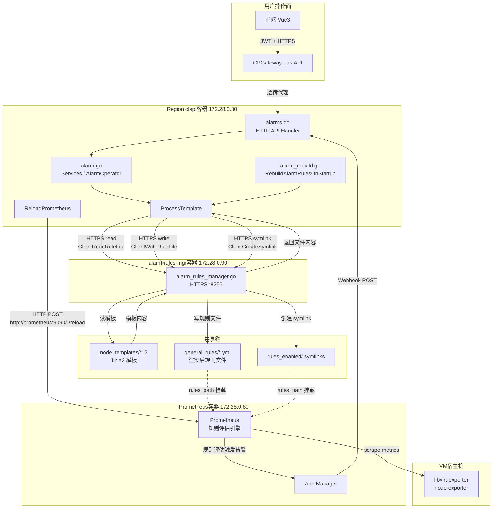
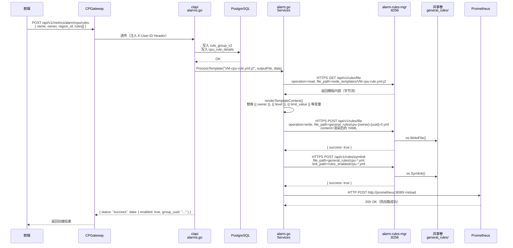
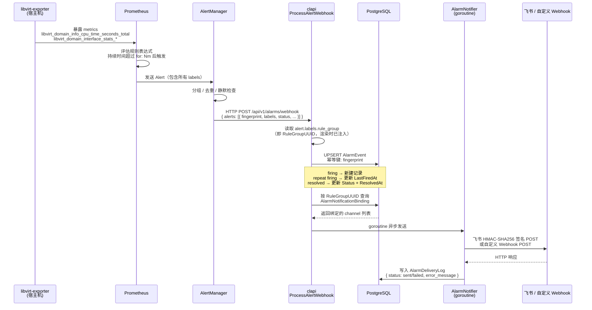
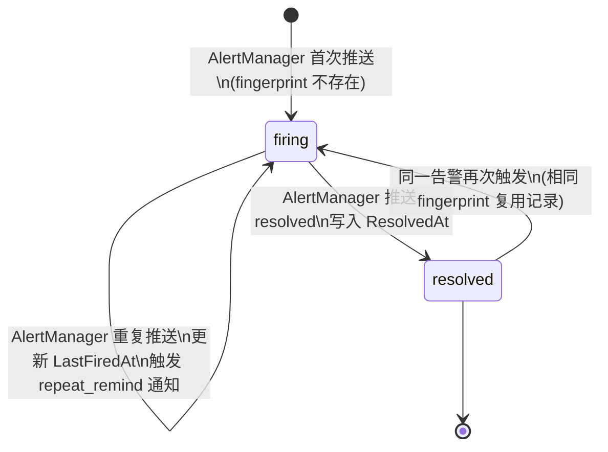
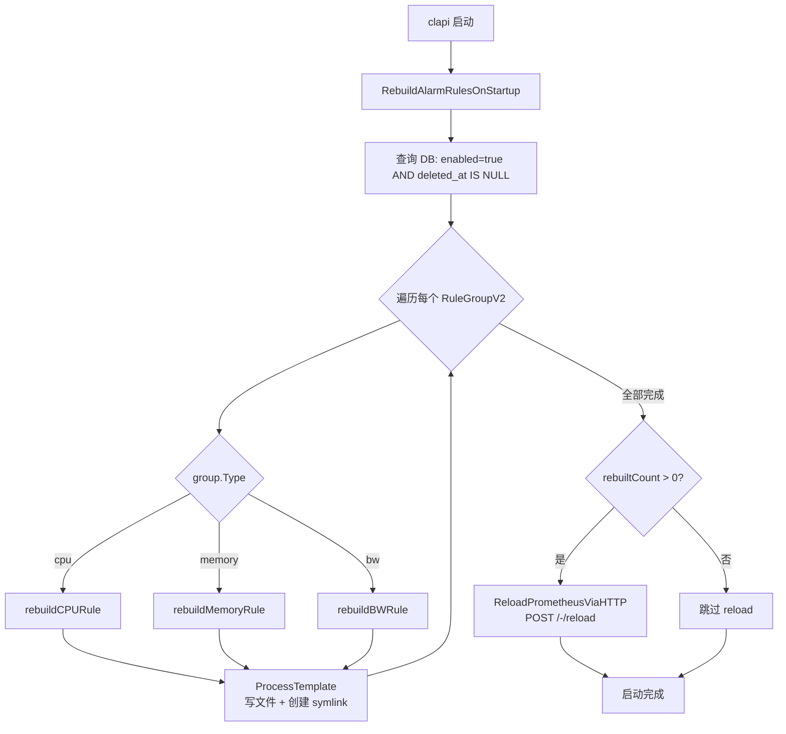

# VM 告警规则推送与触发流程 — 架构开发说明

> 适用范围：CloudLand IaaS 平台 VM 告警子系统（CPU / 内存 / 带宽）  
> 版本状态：当前实现（Docker Compose 单 Region 部署）

---

## 1. 组件总览

| 容器 / 服务 | Docker 网络 IP | 角色 |
|---|---|---|
| `clapi`（Go REST API） | `172.28.0.30` | 告警规则管理、规则文件下发、告警回调处理 |
| `alarm-rules-mgr`（Go HTTP Server） | `172.28.0.90` | 以 root 权限操作 Prometheus 规则文件（写、symlink、chown、reload） |
| `prometheus` | `172.28.0.60` | 规则评估引擎，监控 VM metrics |
| `alertmanager` | — | 聚合告警，通过 Webhook 回调 clapi |
| `node-exporter` / `libvirt-exporter` | — | VM 宿主机暴露 CPU/内存/带宽 metrics |

**关键共享卷（宿主机 → 多容器）**

```
deploy/docker/volumes/prometheus/
  general_rules/   ← alarm-rules-mgr 写入、Prometheus 读取（rules_path）
  rules_enabled/   ← alarm-rules-mgr 创建 symlink，Prometheus 从此目录加载规则
  node_templates/  ← clapi 读（渲染模板用），alarm-rules-mgr 读（响应 clapi read 请求）
```

---

## 2. 架构全景图



---

## 3. 规则推送流程（配置平面）

### 3.1 整体时序



### 3.2 `ProcessTemplate` 内部逻辑

```mermaid
flowchart TD
    A[调用 ProcessTemplate<br/>templateFile, outputFile, data] --> B{isRemotePrometheus?}

    B -- 是 Docker 部署\n配置了 alarm_rules_manager.host --> C[HTTPS 调用 ClientReadRuleFile\nGET /api/v1/rules/file\noperation=read]
    B -- 本地部署 --> D[os.ReadFile 直接读模板]

    C --> E[alarm-rules-mgr\n读取 node_templates/*.j2]
    D --> E2[本地读取模板文件]
    E --> F[返回模板字节内容]
    E2 --> F

    F --> G{是否网络资源模板?<br/>contains 'compute-network-resources'}
    G -- 是 --> H[renderNetworkResourcesTemplate<br/>for 循环展开多种网络类型]
    G -- 否 --> I[renderTemplateContent<br/>字符串替换 {{ var }} 占位符]

    H --> J[渲染后 YAML 内容]
    I --> J

    J --> K{isRemotePrometheus?}
    K -- 是 --> L[HTTPS 调用 ClientWriteRuleFile\nPOST /api/v1/rules/file\noperation=write]
    K -- 否 --> M[os.WriteFile + os.Chown\n写到 general_rules/]

    L --> N[alarm-rules-mgr\nos.WriteFile 到挂载卷]
    M --> N2[本地写文件]

    N --> O[HTTPS 调用 ClientCreateSymlink\nPOST /api/v1/rules/symlink]
    N2 --> O2[os.Symlink]

    O --> P[alarm-rules-mgr\nos.Symlink 到 rules_enabled/]
    O2 --> P2[本地创建 symlink]
```

### 3.3 多级阈值文件命名规则

每个告警规则组（`RuleGroupV2`）包含多条 `detail`，每条 detail 生成独立的 Prometheus 规则文件：

| 类型 | 文件名格式 | 示例 |
|---|---|---|
| CPU | `cpu-{owner}-{group_uuid}-{index}.yml` | `cpu-admin-d63f9e52-0.yml` |
| 内存 | `memory-{owner}-{group_uuid}-{index}.yml` | `memory-admin-d63f9e52-0.yml` |
| 带宽入站 | `bw-in-{owner}-{group_uuid}-{index}.yml` | `bw-in-admin-48260477-0.yml` |
| 带宽出站 | `bw-out-{owner}-{group_uuid}-{index}.yml` | `bw-out-admin-48260477-0.yml` |

**Alert 名称**也包含 `detail_index` 后缀，保证 Prometheus 内唯一：

```yaml
- alert: CPUUsage_{{ owner }}_{{ rule_group }}_{{ detail_index }}
```

删除规则组时使用 glob 模式 `cpu-{owner}-{uuid}-*.yml` 清理所有关联文件。

---

## 4. 告警触发流程（数据平面）



### 4.1 告警状态机



### 4.2 幂等键来源

`fingerprint` 由 AlertManager 根据 `alertname + labels 集合` 哈希生成，同一条告警生命周期内固定不变。clapi 在渲染规则模板时已将 `rule_group`（RuleGroupUUID）写入 `labels` 块，AlertManager 触发告警时原样透传，无需额外改造模板。

---

## 5. 启动重建流程

clapi 重启时，`RebuildAlarmRulesOnStartup()` 确保 DB 与 Prometheus 规则文件状态一致：



---

## 6. TLS 认证架构

`clapi` 与 `alarm-rules-mgr` 之间使用 TLS 单向验证（clapi 验证 alarm-rules-mgr 的服务端证书）：

```mermaid
graph LR
    subgraph clapi容器
        CL[PrometheusClient\nhttps://alarm-rules-mgr:8256]
        CERT[/etc/ssl/certs/alarm_rules_manager.crt\n受信任 CA 证书]
    end

    subgraph alarm-rules-mgr容器
        SERVER[Gin TLS Server\n:8256]
        KEY[/certs/cland/selfsigned.key]
        CRT[/certs/cland/selfsigned.crt]
    end

    CL -->|TLS 握手| SERVER
    CERT -.->|验证| SERVER
    KEY -.->|私钥| SERVER
    CRT -.->|服务端证书\n含 dns_name=alarm-rules-mgr| SERVER
```

证书 SAN（Subject Alternative Name）必须包含：
- `dns_name = alarm-rules-mgr`（Docker 网络内的容器 hostname）
- `dns_name = clapi`
- `ip_address = 127.0.0.1`

由 `deploy/docker/scripts/init-certs.sh` 生成，使用 `certtool` 工具。

---

## 7. 关键配置路径

### 7.1 clapi `conf/config.toml`

```toml
[monitor]
host = "prometheus"    # 用于 metrics 查询 :9090
port = "9090"

[alarm_rules_manager]
host = "alarm-rules-mgr"    # 用于规则文件操作 :8256
                             # 缺省时 fallback 到 monitor.host
```

### 7.2 `isRemotePrometheus` 判断

```
alarm_rules_manager.host 非本地 IP
    → isRemotePrometheus = true
    → 所有文件操作（ReadFile / WriteFile / CreateSymlink）走 HTTPS → alarm-rules-mgr
    → Reload 也走 alarm-rules-mgr 转发 systemctl kill -s SIGHUP prometheus.service

alarm_rules_manager.host 为本地 IP 或空
    → isRemotePrometheus = false
    → 文件操作直接 os.* 系统调用
    → Reload 走 HTTP POST localhost:9090/-/reload
```

### 7.3 alarm-rules-mgr 环境变量

| 变量 | 说明 |
|---|---|
| `ALARM_RULES_LISTEN` | 监听地址，如 `0.0.0.0:8256` |
| `ALARM_RULES_CERT` | TLS 证书路径 |
| `ALARM_RULES_KEY` | TLS 私钥路径 |

---

## 8. Prometheus 规则文件示例

渲染后的 `cpu-admin-d63f9e52-0.yml`（警告级别）：

```yaml
groups:
- name: cpu_admin_d63f9e52-8bd5-4c2b-84d7-7ce214805320_0
  rules:
  - alert: CPUUsage_admin_d63f9e52-8bd5-4c2b-84d7-7ce214805320_0
    expr: |
      (
        (
          sum by (domain) (rate(libvirt_domain_info_cpu_time_seconds_total[1m]))
          / on (domain) libvirt_domain_info_virtual_cpus
        ) * 100 > 80
      )
      * on (domain) group_left(instance_id, rule_id)
      max by (domain, instance_id, rule_id) (
        up{job="vm-group-metadata", rule_id=~"alarm-cpu-.*-d63f9e52-.*"} == 1
      )
    for: 5m
    labels:
      severity: "warning"
      region_id: "region-001"
      rule_id: "alarm-cpu-admin-d63f9e52-8bd5-4c2b-84d7-7ce214805320"
      global_rule_id: "mem-default"
      rule_group: "d63f9e52-8bd5-4c2b-84d7-7ce214805320"
      alert_type: cpu
      owner: "admin"
    annotations:
      summary: "CPU Usage Alert ({{ $value }}%)"
      description: "VM {{ $labels.domain }} CPU usage > 80% for 5 minutes. ..."
```

`rule_group` label 是 AlertManager 回调时 clapi 定位 `RuleGroupUUID` 的关键字段。

---

## 9. 常见问题排查

| 症状 | 排查点 |
|---|---|
| `failed to render cpu/memory/bw rule template` | 检查 `alarm_rules_manager.host` 是否指向 `alarm-rules-mgr` 而非 `prometheus`；检查 `node_templates/` 卷是否挂载 |
| `x509: certificate is not valid for any names` | TLS 证书缺少 `dns_name = alarm-rules-mgr` SAN；重新运行 `init-certs.sh` 并重建容器 |
| `Failed to write file: chown: unknown user prometheus` | alarm-rules-mgr 容器内无 prometheus 系统用户（Alpine）；`changeOwner` 已改为优雅跳过 |
| Prometheus 无规则 / 规则重启消失 | 检查 `general_rules/` 和 `rules_enabled/` 是否有宿主机 volume 挂载；检查 `RebuildAlarmRulesOnStartup` 日志 |
| 告警触发但无通知 | 检查 `alarm_delivery_logs` 表；检查 `AlarmNotificationBinding` 是否有渠道绑定 |
