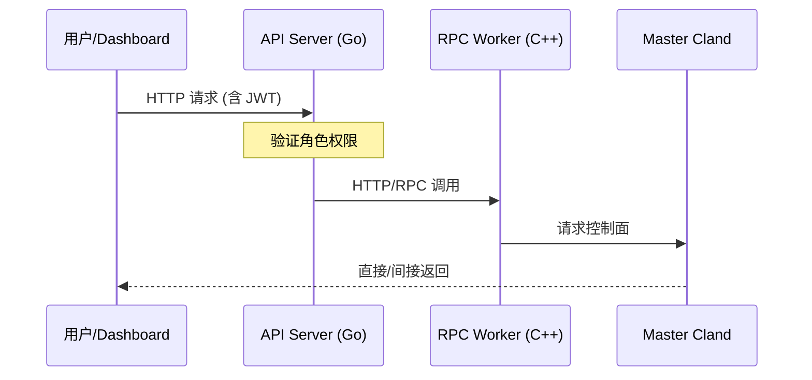

# 系统架构 - API 服务层

## 模块介绍

API 服务层基于 **Go 语言和 Gin 框架** 构建，是外部访问 CloudLand 的唯一入口。

### 核心功能

- **JWT 认证**：全站状态化 Session 校验。
- **RBAC 授权**：基于组织与角色的访问控制模型。
- **参数校验**：使用 `govalidator` 进行严格的输入验证。
- **API 聚合**：对底层 `cland` 的 RPC 服务进行 REST 化包装。

## 请求链路

