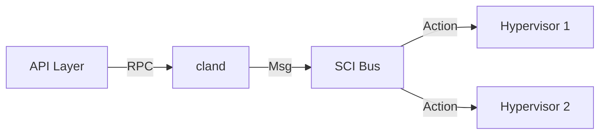

# 系统架构 - 控制面 (cland)

## 模块介绍

`cland` 是整个平台的控制中枢 (Control Plane)，负责资源调度与全局状态同步。

### 核心功能

- **资源池化管理**：感知所有计算节点的实时健康状态与负载。
- **任务调度引擎**：基于负载均衡策略，为新实例分配最合适的 Hypervisor。
- **配置持久化**：统一维护 VPC、安全组、快照等全局元数据。

## 通信模型

`cland` 核心采用 C++ 编写，通过高性能的消息通道与各计算节点进行异步通信，极大地降低了调度延迟。

