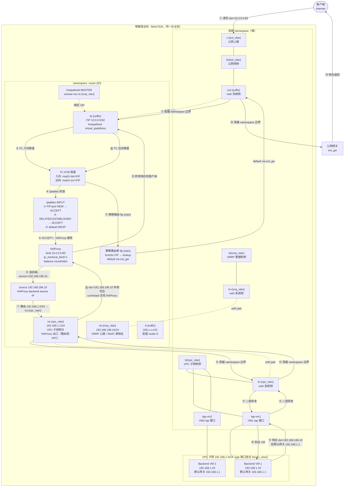
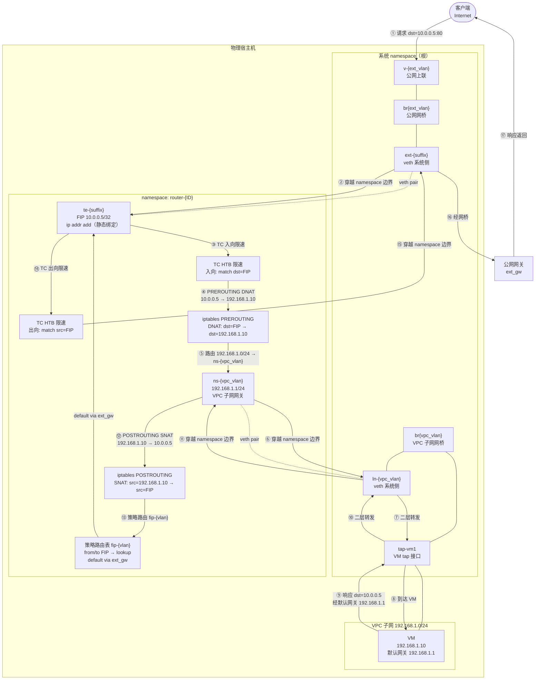

# 负载均衡（Load Balancer）架构

## 概述

CloudLand 的负载均衡基于 **HAProxy + Keepalived/VRRP** 实现，提供四层（TCP）和七层（HTTP/HTTPS）负载均衡，以及主备高可用能力。整个系统分为前端 UI、网关代理、Go API/服务层、Shell 脚本执行层四个层次。

---

## 核心数据模型

### 实体关系

```
LoadBalancer ─── 1:1 ──→ VrrpInstance   （高可用节点对）
LoadBalancer ─── 1:1 ──→ Router         （所属 VPC）
LoadBalancer ─── 1:N ──→ FloatingIp     （公网入口）
LoadBalancer ─── 1:N ──→ Listener       （监听器）
Listener     ─── 1:N ──→ Backend        （后端服务器）
```

### VrrpInstance 字段说明

| 字段 | 类型 | 含义 |
|------|------|------|
| `Hyper` | int32 | MASTER 节点的物理宿主机 ID（hypervisor） |
| `Peer` | int32 | BACKUP 节点的物理宿主机 ID |
| `VrrpSubnetID` | int64 | VRRP 专用管理子网（type="vrrp"，固定 192.168.196.0/24） |
| `RouterID` | int64 | 关联的 VPC 路由器 ID |

**VrrpSubnet** 是独立的管理子网，不属于用户 VPC 子网，每个 Router 唯一，仅用于 VRRP 协议通信和 HAProxy 的 SNAT 源地址。

---

## 三层地址空间

| 角色 | 子网类型 | 地址示例 | 接口 | 用途 |
|------|---------|---------|------|------|
| 公网浮动IP（FIP） | public | 10.0.0.5/32 | `te-{ID}-{vlan}` | 用户访问入口，由 Keepalived 动态绑定 |
| VRRP 管理IP | vrrp | 192.168.196.10/24 | `ns-{vlan}` | VRRP 心跳通信，HAProxy SNAT 源地址 |
| 后端 VM IP | private | 192.168.1.10/24 | VM 网卡 | 实际应用服务 |

---

## 网络命名空间拓扑

每个 LoadBalancer 的两个 VRRP 节点各运行在一台物理宿主机的 **router namespace** 内，Keepalived 和 HAProxy 均运行在该 namespace 中。

```
宿主机 1 (MASTER)                          宿主机 2 (BACKUP)
┌──────────────────────────────────┐      ┌──────────────────────────────────┐
│  router-{ID} namespace           │      │  router-{ID} namespace           │
│                                  │      │                                  │
│  ns-{vlan}:  192.168.196.10/24  │◄────►│  ns-{vlan}:  192.168.196.20/24  │
│  te-{suffix}: 10.0.0.5/32 (VIP) │      │  te-{suffix}: (VIP 飘到此处)    │
│  ti-{suffix}: 169.x.x.x/31      │      │  ti-{suffix}: 169.x.x.x/31      │
│                                  │      │                                  │
│  [Keepalived] MASTER             │      │  [Keepalived] BACKUP             │
│  [HAProxy]    监听 10.0.0.5:80   │      │  [HAProxy]    监听 (VIP 不在时)  │
└──────┬───────────────────────────┘      └──────────────────────────────────┘
       │ br{ext_vlan} + veth pair
       │ ext-{suffix} ↔ te-{suffix}
       ▼
  公网网桥（物理网络）

       │ ns-{vlan} → br{vrrp_vlan} → VLAN/VXLAN
       ▼
  VPC 子网（192.168.1.0/24）
  ┌─────────────────┐  ┌─────────────────┐
  │  Backend VM 1   │  │  Backend VM 2   │
  │  192.168.1.10   │  │  192.168.1.20   │
  └─────────────────┘  └─────────────────┘
```

### router-0 的角色

`router-0` 是宿主机上的全局系统网关 namespace，通过 `ti-{suffix} ↔ int-{suffix}` veth pair 与每个 `router-{ID}` 点对点相连（169.x.x.x/31），作为后者的默认出口网关（VM 访问外网时经此 SNAT 出去）。

**LB 的入站流量不经过 router-0。** 公网流量通过独立的 veth pair（`ext-{suffix} ↔ te-{suffix}`）直接进入 `router-{ID}` namespace，被 HAProxy 直接消费。

---

## LB 的 FIP 与普通 VM 的 FIP 对比

| 对比项 | 普通 VM FIP | LB FIP |
|--------|------------|--------|
| 脚本 | `create_floating.sh` | `create_lb_floating.sh` |
| 是否做 DNAT | **是**（PREROUTING 转发到 VM 内网 IP） | **否** |
| 是否做 SNAT | **是**（POSTROUTING 改为 FIP） | HAProxy 自行 SNAT（源地址改为 VRRP IP） |
| FIP 绑定方式 | `ip addr add` 静态绑定到接口 | Keepalived `virtual_ipaddress` 动态绑定 |
| 流量终结点 | 内网 VM | HAProxy 进程本身 |

普通 VM FIP 的关键 iptables 规则：
```bash
iptables -t nat -I PREROUTING  -d $ext_ip -j DNAT --to-destination $int_ip
iptables -t nat -I POSTROUTING -s $int_ip -j SNAT --to-source $ext_ip
```

LB FIP **没有以上规则**，只配置策略路由：
```bash
ip rule add from $ext_ip lookup fip-{vlan}
ip rule add to   $ext_ip lookup fip-{vlan}
ip route add default via $ext_gw table fip-{vlan}
```

---

## 数据包进入 namespace 后的处理链

公网流量从 `br{ext_vlan}` 经 veth pair 进入 `router-{ID}` namespace 后，经过两层处理才能到达 HAProxy。

### TC 限速（create_lb_floating.sh）

带宽值由用户创建 FIP 时通过 API 传入（`inbound` / `outbound` 字段），API 层校验范围为 **1 ~ 20000 Mbit/s**，字段可选，不传则为 0 表示不限速。

在 `te-{suffix}` 接口上按 FIP 地址匹配，对入/出方向分别限速：

```bash
# 入方向：匹配 dst=$ext_ip，限制为用户指定的 inbound Mbit/s
tc qdisc add dev te-{suffix} root handle 1: htb default 10
tc class add dev te-{suffix} parent 1: classid 1:{mark_id} htb rate {inbound}mbit
tc filter add dev te-{suffix} protocol ip parent 1:0 prio {mark_id} u32 \
    match ip dst $ext_ip/32 flowid 1:{mark_id}

# 出方向：匹配 src=$ext_ip，限制为用户指定的 outbound Mbit/s
tc class add dev te-{suffix} parent 1: classid 1:{mark_id2} htb rate {outbound}mbit
tc filter add dev te-{suffix} protocol ip parent 1:0 prio {mark_id2} u32 \
    match ip src $ext_ip/32 flowid 1:{mark_id2}

# inbound/outbound 为 0 时跳过，不添加 TC 规则（不限速）
```

### iptables INPUT 白名单（create_keepalived_conf.sh）

`router-{ID}` namespace 由 `create_local_router.sh` 初始化时设置 `INPUT` 链默认 DROP，只放行 RELATED/ESTABLISHED。`create_keepalived_conf.sh` 在启动 Keepalived 前，为每个 FIP 的每个监听端口精确添加放行规则：

```bash
# 先清除该 FIP 已有的 INPUT 规则（防止重复）
for num in $(iptables -n -L --line-numbers | grep "<ext_ip>" | awk '{print $1}' | sort -nr); do
    iptables -D INPUT $num
done

# 为每个 FIP:port 放行新连接
iptables -A INPUT -p tcp -m tcp -d $ext_ip --dport $port \
    -m conntrack --ctstate NEW -j ACCEPT
```

没有这条规则，所有到 FIP 的新连接都会被 DROP，HAProxy 无法收到请求。

### namespace 内完整 iptables 规则优先级

```
iptables INPUT chain（router-{ID} namespace）
  ├── ACCEPT  src 属于 nonat ipset（VPC 内网回程）      ← create_local_router.sh
  ├── ACCEPT  RELATED,ESTABLISHED                        ← create_local_router.sh
  ├── ACCEPT  dst=$ext_ip dport=$port ctstate=NEW        ← create_keepalived_conf.sh（每个 FIP:port 一条）
  ├── ACCEPT  dst=$vrrp_ip ctstate=NEW                   ← set_vrrp_ip.sh（VRRP 管理IP）
  └── DROP    （默认）                                   ← create_local_router.sh
```

---

## 数据包完整流转路径

> 实线箭头（→）为入站方向，虚线箭头（--→）为出站方向，粗边框节点为 namespace 内的处理逻辑。



---

## 普通 VM FIP 流量路径（对比）

与 LB FIP 的核心区别：没有 HAProxy 中转，靠 iptables DNAT/SNAT 直接转发，FIP 静态绑定到接口，不需要 Keepalived。



### LB FIP vs 普通 VM FIP 流量对比

| 对比项 | 普通 VM FIP | LB FIP |
|--------|------------|--------|
| FIP 绑定方式 | `ip addr add` 静态绑定到 `te-{suffix}` | Keepalived `virtual_ipaddress` 动态绑定 |
| 入站处理 | iptables DNAT（FIP → VM 内网 IP） | iptables 白名单放行 → HAProxy 接收 |
| 出站处理 | iptables SNAT（VM 内网 IP → FIP） | HAProxy `source` SNAT（→ VRRP 管理 IP） |
| namespace 穿越次数 | 2次（系统→router-{ID}→系统） | 2次（系统→router-{ID}→系统） |
| 流量终结点 | VM 本身 | HAProxy 进程（再转发到后端） |
| 高可用 | 无（单点） | Keepalived VRRP 主备切换 |

---

## 为什么 VM 的 tap 接口在系统 namespace 而不是 router-{ID} namespace

### L2 与 L3 职责分离

CloudLand 的网络架构遵循一个核心原则：**用 VLAN/VXLAN 做 L2 隔离，用 network namespace 做 L3 路由/NAT**，两层职责严格分离。

| 职责 | 在哪里处理 | 原因 |
|------|-----------|------|
| 同子网 VM 互访（L2） | 系统 namespace（网桥直接转发） | 纯二层，无需路由，性能最优 |
| 安全组过滤 | 系统 namespace（tap 接口上） | 靠近 VM，iptables/ebtables 精准控制 |
| 跨子网路由 / NAT / FIP | `router-{ID}` namespace | L3 网关职责 |
| VLAN/VXLAN 隔离 | 系统 namespace（网桥） | 内核二层隔离，性能好 |

### 具体原因

**1. 同子网 VM 之间的 L2 流量不需要经过 namespace**

同一 VPC 子网内 VM 互访是纯二层转发，在 `br{vpc_vlan}` 网桥上直接完成：

```
VM1 (tap1) → br{vpc_vlan} → VM2 (tap2)
```

如果 tap 接口放在 `router-{ID}` namespace 里，所有二层流量都要绕经 namespace，反而多余。只有需要跨 L3 边界（跨子网、FIP、NAT）的流量才进入 namespace。

**2. KVM/QEMU 的 tap 接口天然在系统 namespace**

QEMU 进程创建 tap 接口时默认在系统 namespace，libvirt/virsh 的网络模型基于网桥而非 netns 设计，将 tap 移入 netns 需要额外处理且与 virsh 管理模型不兼容。

**3. 安全组在系统 namespace 的 tap 接口上生效**

安全组规则通过 iptables/ebtables 挂在 tap 接口上（`reapply_secgroup.sh`），在系统 namespace 的网桥层完成过滤，比在 router namespace 里处理更靠近 VM，能做到每个 VM 独立的精细控制。

### 结论

`router-{ID}` namespace 是一个纯粹的 **L3 软件路由器**，只有需要跨 L3 边界的流量才进入它。VM 的 tap 接口留在系统 namespace 的网桥上，最大化利用内核网桥的二层转发性能，namespace 只在必要时介入。

---

## HAProxy 如何访问后端 VM

HAProxy 与后端 VM 处于同一 VPC 的二层/三层网络，通过 `ns-{vpc_vlan}` 接口（VPC 子网网关，连接到 `br{vpc_vlan}` 网桥）直接可达，无需额外 NAT 或隧道。

**SNAT 的必要性**：HAProxy 将源 IP 改为 VRRP 管理 IP（192.168.196.x），是为了确保后端 VM 的响应包走默认网关（`ns-{vpc_vlan}`）回到 `router-{ID}` namespace，被 HAProxy 的 conntrack 正确关联，而不是被 VM 的路由送往其他地方。

---

## 高可用切换机制

1. 两台宿主机的 `router-{ID}` namespace 均运行 Keepalived，通过 `ns-{vlan}` 互发 VRRP 心跳（单播，`unicast_peer` 指定对端 VRRP 管理 IP）
2. MASTER 宕机后，BACKUP 接管 VIP（Keepalived 将 `virtual_ipaddress` 绑定到自身的 `te-{suffix}`）
3. HAProxy 两端均部署完整配置（`toall=` 广播），`ip_nonlocal_bind=1` 允许非持有 VIP 的一端提前绑定端口，切换无需重启 HAProxy
4. 节点成为 MASTER 时，Keepalived 触发 `notify_master set_route_table.sh`，重新执行策略路由表的默认路由（`ip route replace default via $ext_gw table fip-{vlan}`），确保 FIP 出向流量路由正确恢复

---

## 脚本执行链

```
API: LoadBalancerAdmin.Create()
  └─ HyperExecute → set_vrrp_ip.sh
       初始化 router namespace、veth pair、VRRP 子网IP
       └─ RPC 回调 SetVrrpIp（更新 VrrpInstance.Hyper / .Peer）

API: CreateVrrpConf()
  └─ HyperExecute → create_keepalived_conf.sh
       生成 Keepalived 配置，启动 VRRP 实例和虚拟IP

API: BackendAdmin.CreateHaproxyConf()
  └─ HyperExecute (toall=) → create_haproxy_conf.sh
       生成并下发 HAProxy 配置到 MASTER 和 BACKUP 两端

API: LbFloatingIpAdmin.Create()
  └─ HyperExecute → create_lb_floating.sh
       创建 veth pair、配置策略路由、TC 限速
```

---

## 关键源码位置

| 类别 | 路径 | 内容 |
|------|------|------|
| 数据模型 | `api/src/model/loadbalancer.go` | VrrpInstance、LoadBalancer、Listener、Backend |
| LB 服务 | `api/src/services/loadbalancer.go` | CreateVrrpInstance、CreateVrrpConf |
| 后端服务 | `api/src/services/backend.go` | CreateHaproxyConf、HAProxy 配置 JSON 构建 |
| 监听器服务 | `api/src/services/listener.go` | 证书 Base64 编码、触发 Keepalived 更新 |
| RPC 回调 | `api/src/rpcs/set_vrrp_ip.go` | 脚本完成后更新 Hyper/Peer 字段 |
| 网关代理 | `cpgateway/app/api/endpoints/cloudland/network.py` | 透明转发所有 /load_balancers/** 请求 |
| VRRP 初始化 | `scripts/kvm/set_vrrp_ip.sh` | 网络命名空间、veth、VRRP 子网 |
| Keepalived 配置 | `scripts/kvm/create_keepalived_conf.sh` | 生成 keepalived.conf，启动 VRRP |
| HAProxy 配置 | `scripts/kvm/create_haproxy_conf.sh` | 生成 haproxy.cfg，下发到两端 |
| LB 浮动IP | `scripts/kvm/create_lb_floating.sh` | veth、策略路由、TC 限速（无 DNAT） |
| 普通浮动IP | `scripts/kvm/create_floating.sh` | veth、DNAT/SNAT（VM 专用） |
| 系统路由器 | `scripts/kvm/system_router.sh` | router-0 初始化（公网出口网关） |
| 本地路由器 | `scripts/kvm/create_local_router.sh` | router-{ID} namespace 初始化 |
