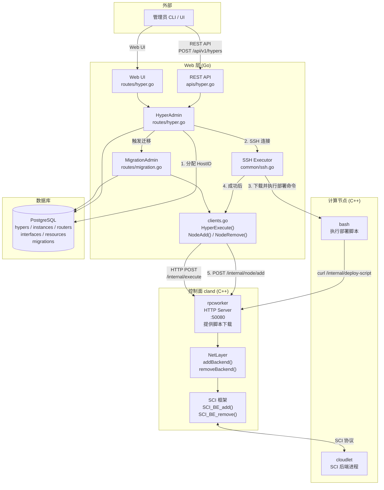
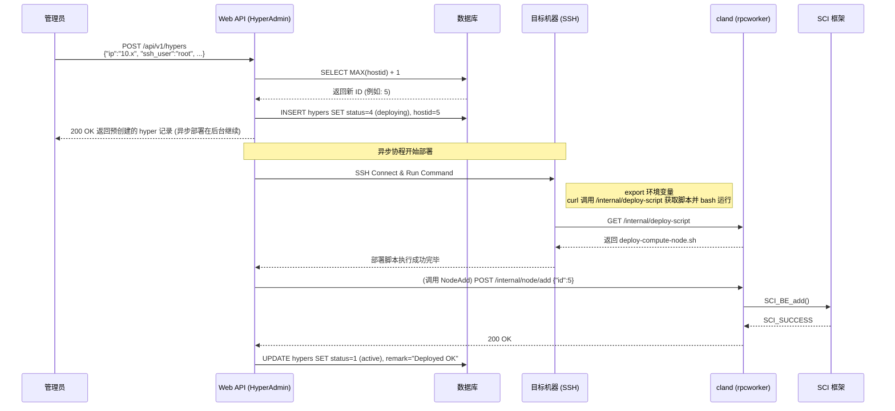
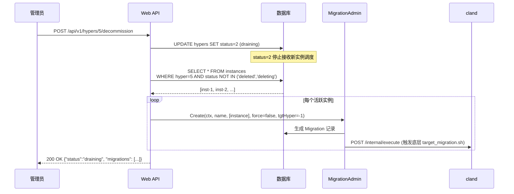
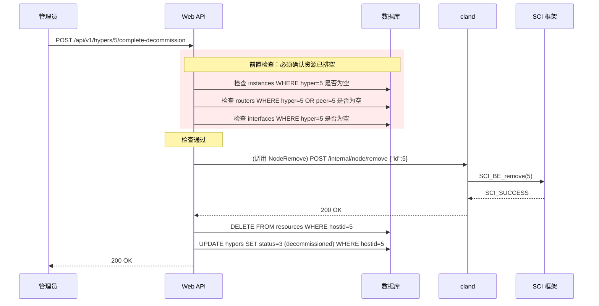

# 计算节点生命周期管理 — 纯 API 驱动部署与服务调用关系

## 系统架构概览



---

## 阶段一览

| # | 阶段 | 触发方 | 服务调用链 |
|---|------|--------|-----------|
| A | 部署 (Deploy) | 管理员 | API → Web 分配ID → Web SSH目标机执行部署 → Web 调用 cland `/internal/node/add` → `SCI_BE_add()` |
| B | 软维护 (Pause) | 管理员 | API → `HyperAdmin.Patch()` → DB 更新 status=0 (disabled) |
| C | 退役 (Decommission) | 管理员 | API → `HyperAdmin.Decommission()` → `MigrationAdmin.Create()` 触发迁移 → cland `/internal/execute` |
| D | 移除 (Remove) | 管理员 | API → `HyperAdmin.CompleteDecommission()` → cland `/internal/node/remove` → `SCI_BE_remove()` + 清理 DB |

---

## 步骤 A：API 驱动部署新节点 (Deploy)

彻底摒弃 `host.list` 和人工运行部署脚本。管理员直接提供机器的 SSH 信息，系统全自动完成部署和注册。



### 接口定义

**REST API 端点** — `POST /api/v1/hypers`

```json
// Request
{
  "ip": "192.168.1.100",
  "ssh_user": "root",
  "ssh_password": "mypassword",
  "network_device": "eth0",
  "vlan_device": "eth1",
  "zone_name": "zone1"
}

// Response 200 (表示已接受请求加入后台部署行列)
{
  "hostid": 5,
  "hostname": "hyper-192-168-1-100",
  "status": "deploying",
  "remark": "Deployment in progress..."
}
```

前端可以通过轮询 `GET /api/v1/hypers/5` 来观察状态从 `deploying(4)` 变为 `active(1)` 或 `deploy_failed(5)`。

**cland 新增端点** — `GET /internal/deploy-script`
返回控制面本地的 `/opt/cloudland/deploy/docker/scripts/deploy-compute-node.sh` 文件内容给计算节点。

---

## 步骤 B：退役排空 (Decommission)



### 接口定义

**REST API 端点** — `POST /api/v1/hypers/:hostid/decommission`

```json
// Response 200
{
  "hostid": 5,
  "status": "draining",
  "migrations": [
    { "id": 101, "instance_id": 1, "status": "in_progress" }
  ]
}
```

---

## 步骤 C：完成退役并移除 (Complete Decommission)



### 接口定义

**REST API 端点** — `POST /api/v1/hypers/:hostid/complete-decommission`

```json
// Response 200 (成功)
{ 
  "hostid": 5, 
  "status": "decommissioned" 
}

// Response 409 (有残留资源，拒绝)
{
  "error": "node still has active resources",
  "remaining_instances": 1,
  "remaining_routers": 0,
  "remaining_interfaces": 2
}
```

---

## 部署流程所需网络访问清单

采用此架构后，Web 层和控制面需要新开通以下内部网络访问：

1. **Web 层 ➔ 计算节点 (SSH)**
   - 端口: 22 (或自定义 SSH 端口)
   - 用途: `common/ssh.go` 连接到新节点执行命令。

2. **计算节点 ➔ cland 控制面 (HTTP)**
   - 端口: `50080` (C++ rpcworker HTTP Server 端口) 
   - 注：脚本中写的是 `5006`，如果在防火墙或 HAProxy 后这是转发端口，需要确保计算节点能以此端口访问到控制面。
   - 用途: 下载部署脚本 (`/internal/deploy-script`)。

3. **Web 层 ➔ cland 控制面 (HTTP)**
   - 端口: `50080`
   - 用途: API 注册 (`/internal/node/add`)、移除 (`/internal/node/remove`)、执行命令 (`/internal/execute`)。

---

## 数据库模型状态值补充

**`model.Hyper.Status` 最终枚举定义**：

| 值 | 状态码 | 说明 | 可否被调度新实例 |
|----|--------|------|-----------------|
| 0 | `disabled` | 被管理员手动暂停调度 | ❌ 否 |
| 1 | `active` | 正常运行且接收调度 | ✅ 是 |
| 2 | `draining` | 正在排空实例，准备退役 | ❌ 否 |
| 3 | `decommissioned` | 已彻底从 SCI 和数据库摘除 | ❌ 否 |
| 4 | `deploying` | 刚刚创建并分配了 ID，正在后台 SSH 部署 | ❌ 否 |
| 5 | `deploy_failed` | SSH 部署脚本执行失败，或注册 SCI 失败 | ❌ 否 |
