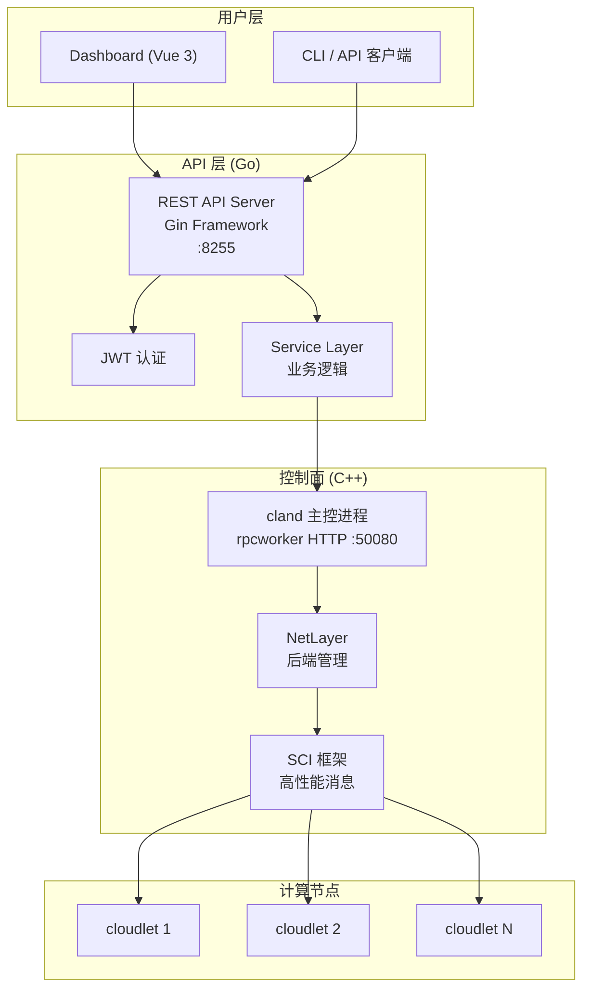

# 架构概览

## 系统架构

CloudLand 采用分层架构设计，各组件职责清晰、松耦合。

```mermaid
graph TB
    subgraph "用户层"
        UI["Dashboard (Vue 3)"]
        CLI["CLI / API 客户端"]
    end

    subgraph "API 层 (Go)"
        API["REST API Server<br/>Gin Framework<br/>:8255"]
        AUTH["JWT 认证"]
        SVC["Service Layer<br/>业务逻辑"]
    end

    subgraph "控制面 (C++)"
        CLAND["cland 主控进程<br/>rpcworker HTTP :50080"]
        NET["NetLayer<br/>后端管理"]
        SCI["SCI 框架<br/>高性能消息"]
    end

    subgraph "计算节点"
        CL1["cloudlet 1"]
        CL2["cloudlet 2"]
        CLN["cloudlet N"]
    end

    UI --> API
    CLI --> API
    API --> AUTH
    API --> SVC
    SVC --> CLAND
    CLAND --> NET
    NET --> SCI
    SCI --> CL1
    SCI --> CL2
    SCI --> CLN
```
