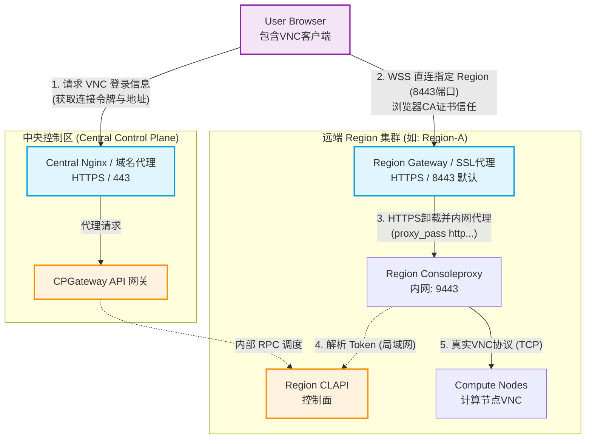
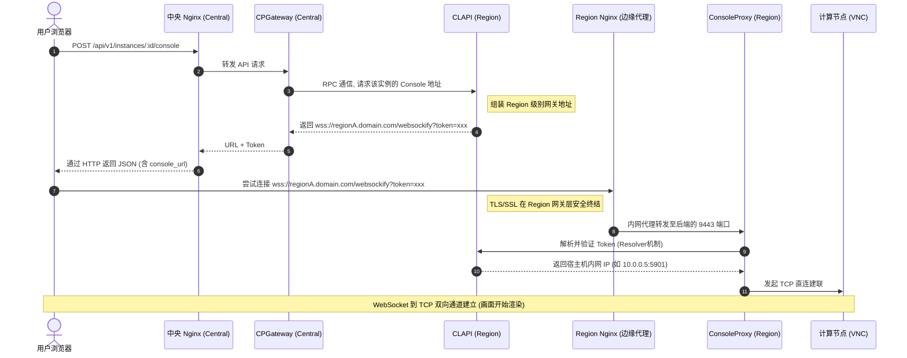

# ConsoleProxy 多 Region 方案：Central Nginx + Region Gateway 模型

## 背景

当前架构中，VNC Console 的 WebSocket 请求链路为：

```
浏览器 → nginx (full) → consoleproxy (region) → clapi resolver → 计算节点 VNC
```

中央 nginx 硬编码 `consoleproxy:9443` 作为 `/websockify` 上游。在多 Region 部署中（中央 `full` 与远程 `region` 分离），nginx 无法访问远程 Region 的 consoleproxy，导致 VNC Console 不可用。

### 为什么不能直接暴露 consoleproxy

直接对外暴露 `consoleproxy:9443` 并使用自签证书时，浏览器在建立 `wss://` 连接时会**静默拒绝**不受信任的证书（不会弹窗让用户确认），导致 VNC 完全不可用。必须在边缘统一做 TLS 终端。

## 方案：Central Nginx + Region Gateway

每个 Region 部署一个轻量级 Region Gateway（Nginx），在边缘统一终结 TLS，内部转发给 consoleproxy。

### 架构流向图



### 请求链路时序图（多 Region）



### 部署模式兼容

| 模式 | Profiles | /websockify 走向 | 说明 |
|------|----------|------------------|------|
| 全量单节点 | `full,dev,region` | Central Nginx (:443) → 本地 consoleproxy | 无需 Region Gateway，现有行为不变 |
| 多 Region 中央 | `full,dev` | 无 /websockify | 中央节点不处理 VNC |
| 多 Region 远程 | `region,region-gateway` | Region Gateway (:8443) → consoleproxy | 每个 Region 独立入口 |

### All-in-one 与 Region Gateway 不冲突

部署拓扑是建机器时就确定的**静态决策**，通过 Profile 组合选择即可：

- **All-in-one** (`full,dev,region`)：不启用 `region-gateway`，中央 Nginx 已有 `/websockify` 路由直接转发给本地 consoleproxy，`CONSOLE_HOST` 留空回退到 Request.Host
- **远程 Region** (`region,region-gateway`)：没有中央 Nginx，region-gateway 在独立端口 (:8443) 处理 WebSocket

`region-gateway` 默认端口为 **8443**（非 443），即使误配 `full,dev,region,region-gateway` 也不会与中央 Nginx 的 443 冲突。生产环境可通过 `REGION_GATEWAY_PORT=443` 显式调整。

## 改动清单

### 1. 新增 Region Gateway Nginx 配置

**新增文件**: `deploy/docker/config/region-gateway/nginx.conf`

Region Gateway 是一个轻量 Nginx，只负责 `/websockify` 的 TLS 终端和 WebSocket 代理。

```nginx
worker_processes auto;
error_log /var/log/nginx/error.log;

events {
    worker_connections 1024;
}

http {
    server {
        listen 443 ssl http2;

        ssl_certificate     /certs/region-gw/selfsigned.crt;
        ssl_certificate_key /certs/region-gw/selfsigned.key;
        ssl_protocols       TLSv1.2 TLSv1.3;

        # WebSocket 代理到内部 consoleproxy
        location /websockify {
            proxy_pass https://consoleproxy:9443;
            proxy_http_version 1.1;
            proxy_set_header Host $host:$server_port;
            proxy_set_header Upgrade $http_upgrade;
            proxy_set_header Connection "upgrade";
            proxy_buffering off;
            client_max_body_size 0;
            proxy_read_timeout 3600s;
        }
    }
}
```

### 2. docker-compose.yml — 新增 region-gateway 服务

**文件**: `deploy/docker/docker-compose.yml`

新增 `region-gateway` 服务，profile 为 `region-gateway`，用标准 `nginx:alpine` 镜像。

```yaml
# ---------- Region Gateway (VNC WebSocket 边缘入口) ----------
region-gateway:
  image: nginx:alpine
  container_name: cloudland-region-gateway
  restart: unless-stopped
  profiles:
    - region-gateway
  volumes:
    - ./config/region-gateway/nginx.conf:/etc/nginx/nginx.conf:ro
    - ./volumes/certs/region-gw:/certs/region-gw:ro
  ports:
    - "${REGION_GATEWAY_PORT:-8443}:443"
  networks:
    cloudland:
      ipv4_address: 172.28.0.45
  depends_on:
    - consoleproxy
```

### 3. docker-compose.yml — clapi 增加 console 配置环境变量

**文件**: `deploy/docker/docker-compose.yml`

clapi 的 `environment` 中增加 `CONSOLE_HOST` 和 `CONSOLE_PORT`，控制返回给前端的 console URL。

```yaml
environment:
  # ... 已有配置 ...
  CONSOLE_HOST: ${CONSOLE_HOST:-}
  CONSOLE_PORT: "${CONSOLE_PORT:-}"
```

- `CONSOLE_HOST` 和 `CONSOLE_PORT` 均无默认值，留空时 clapi 回退到 `c.Request.Host`（即当前请求的 Host），单节点模式下自动指向中央 Nginx (:443)，开箱即用
- 多 Region 模式下在 `.env` 中显式设置 `CONSOLE_HOST` 和 `CONSOLE_PORT=8443`

### 4. clapi 配置绑定 — 确认 viper 读取环境变量

**文件**: clapi 的 viper 初始化代码

**现状**: `console.go` 通过 `viper.GetString("console.host")` 和 `viper.GetInt("console.port")` 读取配置。需确认 viper 能将 `CONSOLE_HOST` 环境变量映射到 `console.host`。

**改动**: 如果 viper 的 `AutomaticEnv()` + `SetEnvKeyReplacer(".", "_")` 已配置，则自动映射。否则需在初始化处增加：

```go
viper.BindEnv("console.host", "CONSOLE_HOST")
viper.BindEnv("console.port", "CONSOLE_PORT")
```

### 5. 中央 nginx — 保持 /websockify（向后兼容）

**文件**: `deploy/docker/config/nginx/ssl.conf`

**不删除** `/websockify` location 块。它已经用了动态解析 + `required: false`，在单节点模式下正常工作，在纯 `full` 模式下 consoleproxy 不存在也不会导致 nginx 崩溃。

### 6. 证书初始化脚本 — 增加 region-gw 证书

**文件**: `deploy/docker/scripts/init-certs.sh`

增加为 Region Gateway 生成自签证书的逻辑：

```bash
# Region Gateway 证书
generate_cert "region-gw" "cloudland-region-gateway"
```

### 7. .env.example — 补充新变量说明

**文件**: `deploy/docker/.env.example`

```bash
# ---- Region Gateway (多 Region 部署) ----
# Region Gateway 是每个远程 Region 的 VNC WebSocket 边缘入口
# 仅在 COMPOSE_PROFILES 包含 region-gateway 时生效
#
# Region Gateway 对外监听端口 (默认 8443，避免与中央 Nginx 443 冲突)
# 生产环境可改为 443
# REGION_GATEWAY_PORT=8443
#
# clapi 返回给前端的 VNC Console 地址
# 单节点模式 (full,dev,region): 留空，自动使用当前请求的 Host（即中央 nginx 地址）
# 多 Region 模式 (region,region-gateway): 设为该 Region 的 Gateway 公网域名或 IP
# CONSOLE_HOST=region1-gw.example.com
# CONSOLE_PORT=8443
```

### 8. docker-compose.yml — 更新头部注释

更新 Profile 说明和服务清单，增加 `region-gateway` 相关文档。

## 验证步骤

### 1. 单节点验证 (`COMPOSE_PROFILES=full,dev,region`)

- 无需设置 `CONSOLE_HOST`
- 创建实例 → 点击 VNC Console
- 确认 `console_url` 为 `wss://<PUBLIC_IP>/websockify?token=xxx`（走中央 nginx）
- 确认 VNC Console 正常工作（回归测试，行为不变）

### 2. 多 Region 验证

中央节点：
```bash
COMPOSE_PROFILES=full,dev docker compose up -d
```

远程 Region 节点：
```bash
# .env 中设置:
COMPOSE_PROFILES=region,region-gateway
CONSOLE_HOST=region1-gw.example.com  # 或 Region 公网 IP
CONSOLE_PORT=8443
# 生产环境可设 REGION_GATEWAY_PORT=443 + CONSOLE_PORT=443

docker compose up -d
```

- 创建实例，确认 `console_url` 为 `wss://region1-gw.example.com:8443/websockify?token=xxx`
- 浏览器先访问 `https://region1-gw.example.com:8443` 信任自签证书（证书信任是 host+port 维度的，必须带端口）
- 确认 VNC Console 正常工作

### 3. 证书验证

- Region Gateway 的自签证书需要用户在浏览器中预先信任
- 生产环境建议使用 Let's Encrypt 或企业 CA 签发的证书

## 风险与回退

| 风险 | 影响 | 缓解 |
|------|------|------|
| Region Gateway 证书未被浏览器信任 | WSS 静默拒绝 | 用户需预先访问 Region Gateway 地址信任证书，或使用正式 CA 证书 |
| viper 环境变量未正确映射 | console_url 中 host 为空 | 步骤 4 中验证 viper 绑定，空值回退到 Request.Host |
| 单节点回归 | 无影响 | 中央 nginx /websockify 保留，行为不变 |
| region-gateway 端口冲突 | 启动失败 | 默认 8443 已避免与中央 Nginx 443 冲突；如有其他占用通过 REGION_GATEWAY_PORT 调整 |

**回退方案**: 移除 region-gateway 服务和配置，恢复到改造前状态。改动完全增量，不破坏现有配置。
