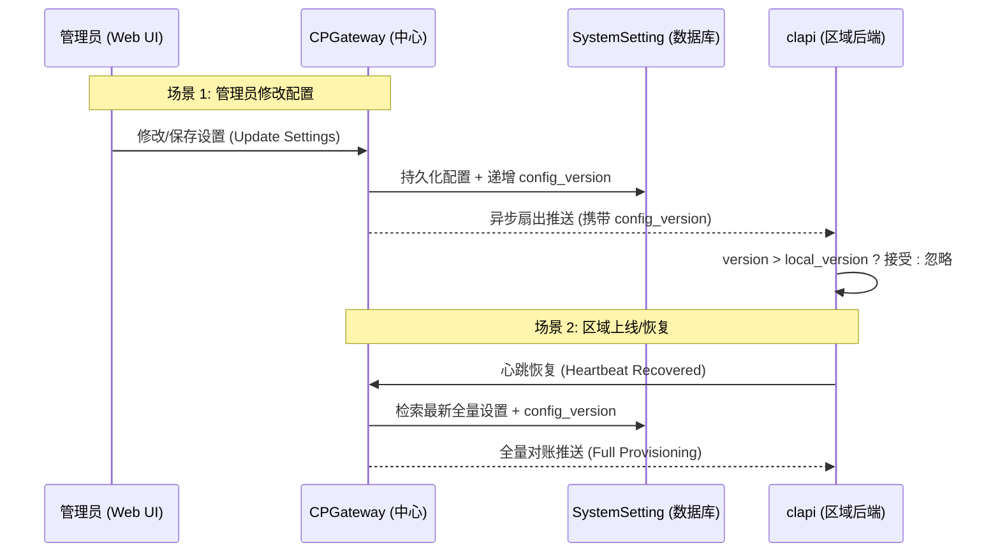

# 设计文档：CloudLand 动态系统设置与多渠道通知系统 (Dynamic System Settings & Notifications)

## 1. 背景与目标
目前 CloudLand 的系统参数及通知方式（SMTP、飞书）硬编码在后端环境变量中（`cpgateway/app/core/config.py`）。管理员调整需要重启服务，且缺乏对 Slack 和通用 Webhook 的支持。

**目标**：
1.  **动态设置**：将关键参数迁移至数据库，支持运行时修改、即时生效。
2.  **多渠道支持**：新增 Slack 和自定义 Webhook 支持。

## 2. 核心架构设计

### 2.1 后端实现 (cpgateway)
- **数据库模型 (`SystemSetting`)**：
  - `key` (主键), `value` (JSON 序列化), `value_type`, `category`, `description`, `is_secret`, `updated_at`.
  - 详见 §3 模型定义。
- **降级策略**：
  - 数据库值缺失时，回退到环境变量 / Pydantic 默认值，而非直接报错。
  - 实现 `get_setting(key, fallback=env_value)` 模式，保障系统鲁棒性。
- **多区域设置分发 (Settings Syncing)**：
  - **同步逻辑**：当管理员更新系统设置时，`cpgateway` 自动将设置推送到所有已注册区域的 `clapi` 服务。
  - **解耦设计**：`clapi` 基于本地镜像的设置运行，不直接依赖 `cpgateway` 的实时查询。
  - **版本控制**：每次设置变更递增全局 `config_version`，同步时携带版本号，clapi 端仅接受 version > local_version 的更新，防止网络乱序导致旧值覆盖新值。
- **API 接口 (仅限 SuperAdmin)**：
  - `GET/PUT /api/v1/system/settings`: 获取/更新设置。
  - `POST /api/v1/system/settings/test-notification`: 测试指定渠道（Email, Feishu, Slack, Webhook）的连通性。

### 2.2 clapi 端实现 (Go)
- **本地存储**：新增 `system_setting_mirror` 表，存储从 cpgateway 同步的设置。
- **Internal API**：
  - `POST /api/v1/internal/system-settings/sync`：接收 cpgateway 推送的设置同步（增量/全量）。
  - 请求携带 `config_version`，仅当 version > 本地 version 时接受更新。
- **改造 notifier.go**：
  - 新增 Slack 通知发送支持。
  - 从本地设置镜像读取通知渠道配置（Slack Webhook URL 等）。

### 2.3 前端实现 (Vue 3)
- **管理页面**：`SystemSettings.vue`。
- **UI 模块划分**：
  - **基础信息 & 资源配额**：名称、URL、默认配额。
  - **通知通道配置**：
    - **Email (SMTP)**：全量配置，密码字段使用密码输入框。
    - **飞书**：Webhook 地址及密钥。
    - **Slack**：Webhook URL（传统 Incoming Webhook），附 payload 格式说明。
    - **自定义 Webhook**：URL、HTTP 方法、自定义 Header。
- **字段渲染**：根据 `value_type` 动态渲染对应输入组件（数字框、文本框、密码框、JSON 编辑器、开关）。

## 3. SystemSetting 数据模型

```python
class SystemSetting(Base):
    __tablename__ = "system_settings"

    key: str            # 主键，如 "SMTP_HOST"
    value: str          # JSON 序列化的值
    value_type: str     # string | number | boolean | json | secret
    category: str       # general | quota | notification
    description: str    # 参数说明
    is_secret: bool     # 是否为敏感值（API 响应中脱敏）
    updated_at: datetime # 最后修改时间，用于同步判断
```

**全局版本控制**：
```python
class SystemConfigVersion(Base):
    __tablename__ = "system_config_version"

    id: int             # 固定为 1，单行记录
    version: int        # 全局递增版本号
    updated_at: datetime
```

**设计说明**：
- `value` 统一使用 JSON 序列化存储，`value_type` 标识实际类型，前端据此选择输入组件。
- `is_secret` 为 `True` 的字段（如 SMTP 密码、Webhook Secret），API 返回时自动脱敏为 `"******"`，复用现有 `mask_secret` 模式。
- 每次 `PUT /settings` 成功后，`config_version` 自增，触发区域同步。

## 4. 建议迁移与新增的参数列表

| 分类 | 参数标识 | value_type | is_secret | 说明 |
| :--- | :--- | :--- | :--- | :--- |
| **基础信息** | `PROJECT_NAME` | string | false | 项目名称 |
| | `FRONTEND_URL` | string | false | 前端地址 |
| **资源配额** | `DEFAULT_CPU_CORES` | number | false | 默认 CPU 配额 |
| | `DEFAULT_RAM_GB` | number | false | 默认内存配额 |
| | `DEFAULT_DISK_GB` | number | false | 默认磁盘配额 |
| | `DEFAULT_PUBLIC_IPS` | number | false | 默认公网 IP 配额 |
| | `DEFAULT_TRAFFIC_GB` | number | false | 默认流量配额 |
| **通知通道** | `NOTIFICATION_CHANNELS` | json | false | 启用的通道列表 ["email","feishu","slack","webhook"] |
| | `SMTP_HOST` | string | false | SMTP 主机 |
| | `SMTP_PORT` | number | false | SMTP 端口 |
| | `SMTP_TLS` | boolean | false | 是否启用 TLS |
| | `SMTP_USER` | string | false | SMTP 用户名 |
| | `SMTP_PASSWORD` | string | true | SMTP 密码 |
| | `SMTP_FROM` | string | false | 发件人地址 |
| | `SMTP_FROM_NAME` | string | false | 发件人名称 |
| | `FEISHU_WEBHOOK_URL` | string | false | 飞书 Webhook 地址 |
| | `FEISHU_SECRET` | string | true | 飞书签名密钥 |
| | `SLACK_WEBHOOK_URL` | string | false | Slack Incoming Webhook 地址 |
| | `CUSTOM_WEBHOOK_URL` | string | false | 自定义 Webhook 地址 |
| | `CUSTOM_WEBHOOK_METHOD` | string | false | 自定义 Webhook HTTP 方法（GET/POST/PUT/PATCH） |
| | `CUSTOM_WEBHOOK_HEADERS` | json | true | 自定义 Webhook Header（含 Auth） |

## 5. 多区域同步机制 (Region Mirroring)
为了保障各区域配置一致性，系统设置采用**中心分发、本地应用**的模式。

### 5.1 同步流程图


### 5.2 触发场景
1. **增量同步**：管理员在 `cpgateway` 控制台点击"保存"设置时，异步广播给所有在线区域，携带 `config_version`。
2. **全量初始化 (Provisioning)**：新区域注册成功后，`cpgateway` 主动推送全量配置。
3. **心跳恢复同步**：离线区域重新上线（心跳恢复）后，自动触发一次配置对账与全量同步（复用现有 `cold_start_sync` 模式）。

### 5.3 执行方式
- `cpgateway` 循环调用各区域 `clapi` 的 `POST /api/v1/internal/system-settings/sync` 接口。
- 与现有 Notification Channel 同步逻辑（`push_channel_to_all_regions`）保持一致的重试策略（指数退避 2s, 4s）。

### 5.4 版本控制与乱序保护
- cpgateway 维护全局 `config_version`（单调递增），每次设置变更 +1。
- 同步请求携带 `config_version`，clapi 端仅在 `request_version > local_version` 时接受更新。
- 全量同步（Provisioning / 心跳恢复）直接覆盖本地版本，以 cpgateway 为准。

## 6. Slack 集成方案

### 6.1 集成方式
采用 **Slack Incoming Webhooks**（传统方式），原因：
- 配置简单，只需一个 URL，与飞书 Webhook 体验一致。
- 适用于单向通知场景（告警推送），无需双向交互。

### 6.2 Payload 格式要求
Slack Incoming Webhook 要求 payload 包含 `text` 字段（纯文本回退）或 `blocks` 字段（富文本 Block Kit）。clapi 端发送时需确保：
- 必须包含 `text` 字段作为 fallback。
- 可选 `blocks` 字段提供富文本格式。

### 6.3 后续演进
若未来需要更丰富的交互（如告警确认按钮），可升级为 Slack App + `chat.postMessage` API。当前阶段 Incoming Webhook 已满足需求。

## 7. 降级与容错策略

### 7.1 配置降级
```
优先级: 数据库值 > 环境变量 > Pydantic 默认值
```
- cpgateway 启动时从数据库加载设置，缺失的 key 自动回退到环境变量或代码默认值。
- 实现 `SettingsService.get(key, fallback)` 方法，统一获取逻辑。
- 数据库不可用时，整个设置层降级为纯环境变量模式，服务不中断。

### 7.2 同步失败容错
- 单区域推送失败不影响其他区域（独立重试）。
- 推送失败的区域在下次心跳恢复时会触发全量同步，最终一致。

## 8. 现状分析与提升

### 8.1 现有同步机制 (Status Quo)
目前系统仅支持部分关键数据的区域同步：
- **通知渠道 (`Notification Channels`)**：已实现心跳恢复后的冷启动全量同步（`cold_start_sync`）。
- **资源对账 (`Consumption Sync`)**：用户登录时按需触发。

### 8.2 本方案带来的改进 (Improvements)
- **配置即版本**：管理员修改全局设置（如注册配额、项目名称、通知渠道配置）后，新区域上线将通过 `Provisioning` 自动获取最新的一致性配置，消除各区域配置漂移的风险。
- **版本控制**：引入 `config_version` 机制，解决并发推送可能导致的乱序覆盖问题。

## 9. 迁移兼容性

### 9.1 环境变量迁移
- 首次部署时，`alembic upgrade` 迁移脚本自动读取现有环境变量，写入 `system_settings` 表。
- 后续环境变量仅作为 fallback，不再作为主要配置源。
- 无需一次性移除所有环境变量，可逐步过渡。

## 10. 实施步骤

### 第一阶段：后端模型与基础 API
- **cpgateway**：
  - 新增 `SystemSetting` + `SystemConfigVersion` 模型。
  - Alembic 迁移脚本（含环境变量初始数据导入）。
  - 实现 `SettingsService`（数据库 → 环境变量 → 默认值 三级降级）。
  - 实现 `GET/PUT /api/v1/system/settings` API（SuperAdmin 鉴权）。

### 第二阶段：clapi 端改造
- **clapi (Go)**：
  - 新增 `system_setting_mirror` 表及 GORM 模型。
  - 新增 `POST /api/v1/internal/system-settings/sync` 接口（含版本校验）。
  - 改造 `notifier.go`：新增 Slack 通知发送支持。

### 第三阶段：多区域同步
- **cpgateway**：
  - 实现设置变更后的异步扇出推送（复用 `push_channel_to_all_regions` 模式）。
  - 扩展心跳恢复逻辑，增加系统设置的全量同步。
  - 新区域注册时自动 Provisioning 全量配置。

### 第四阶段：前端 UI
- **web**：
  - `SystemSettings.vue` 管理页面。
  - 根据 `value_type` 动态渲染输入组件。
  - 通知测试按钮集成。
