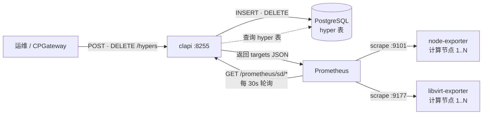
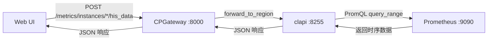

# Prometheus 计算节点自动发现方案

## 一、背景与问题

### 问题
每次新增或删除计算节点（hyper）后，需要手动编辑 `prometheus.yml` 中的 `static_configs`，添加节点 IP 的 exporter 地址（`node_exporter:9101`、`libvirt_exporter:9177`），然后重启 Prometheus 才能生效。

这带来以下痛点：
- 运维人员容易遗忘配置，导致新节点没有监控数据
- 删除节点后旧 target 残留，Prometheus 报 scrape 错误
- 不利于自动化部署流程

### 目标
实现 **计算节点的自动服务发现**：通过 API 添加/删除 hyper 时，Prometheus 自动更新采集目标，无需人工干预。支持 clapi 与 Prometheus 部署在不同主机上。

## 二、方案设计

### 核心思路

利用 Prometheus 原生的 **`http_sd_configs`** 机制：Prometheus 定期轮询 clapi 的 HTTP 端点获取最新的 scrape targets，clapi 实时查询数据库返回结果。

相比 `file_sd_configs`（依赖 Docker 共享卷），`http_sd_configs` 无需共享文件系统，天然支持跨主机部署。

### 架构图

#### 节点注册 & 自动发现



#### 监控数据查询



### 数据流

1. Prometheus 每 30s 向 clapi 发起 HTTP 请求获取 targets
2. clapi 实时查询数据库中所有 hyper 记录，返回 JSON：
   - `GET /api/v1/prometheus/sd/libvirt_exporter` — 所有节点的 `:9177` 地址
   - `GET /api/v1/prometheus/sd/node_exporter` — 所有节点的 `:9101` 地址
3. Prometheus 根据返回的 targets 自动更新采集目标
4. 节点增删时无需任何额外触发，下次轮询自动生效

### http_sd JSON 响应示例

```json
[
  {
    "targets": ["10.193.191.96:9177"],
    "labels": {
      "hostid": "1",
      "hostname": "worknode01"
    }
  },
  {
    "targets": ["10.193.191.100:9177"],
    "labels": {
      "hostid": "2",
      "hostname": "compute-node-02"
    }
  }
]
```

## 三、实现细节

### 3.1 新增文件

#### `api/src/services/prometheus_sd.go`

服务层：
- `GetPrometheusTargets(exporterType)` — 查询所有 hyper，按 exporter 类型返回 `[]SDTarget`
- 支持 `libvirt_exporter`（端口 9177）和 `node_exporter`（端口 9101）

#### `api/src/apis/prometheus_sd.go`

API 层：
- `GET /api/v1/prometheus/sd/:exporter` — 无需认证，返回 Prometheus http_sd 兼容的 JSON
- Prometheus 直接调用此端点，无需 JWT token

### 3.2 修改文件

| 文件 | 改动内容 |
|------|----------|
| `api/src/apis/routes.go` | 注册 `GET /api/v1/prometheus/sd/:exporter`（认证组外，无需 token） |
| `deploy/docker/config/prometheus/prometheus.yml` | `static_configs` 替换为 `http_sd_configs`，URL 使用 `__CLAPI_SD_ENDPOINT__` 占位符 |
| `deploy/docker/docker-compose.yml` | prometheus 添加 `CLAPI_SD_ENDPOINT` 环境变量，entrypoint 用 `sed` 渲染配置；移除共享卷 `prometheus_targets` |
| `deploy/docker/.env.example` | 新增 `CLAPI_SD_ENDPOINT` 变量说明 |

### 3.3 与旧方案对比（file_sd → http_sd 的清理）

| 旧方案（file_sd） | 新方案（http_sd） |
|---|---|
| `RefreshPrometheusTargets()` 写文件 | `GetPrometheusTargets()` 返回数据 |
| `hyper.go` Deploy/Delete 后异步调用 | 无需触发，Prometheus 定时轮询 |
| `services.Init()` 启动时刷新文件 | 无需，首次轮询即获取 |
| Docker 共享卷 `prometheus_targets` | 无需共享卷 |
| 原子写入 `.tmp` + `rename` | 无需文件操作 |

### 3.4 Prometheus 配置

```yaml
# prometheus.yml（__CLAPI_SD_ENDPOINT__ 由容器启动时 sed 替换）

scrape_configs:
  - job_name: 'prometheus_node_exporter'
    http_sd_configs:
      - url: __CLAPI_SD_ENDPOINT__/api/v1/prometheus/sd/node_exporter
        refresh_interval: 30s

  - job_name: 'prometheus_libvirt_exporter'
    http_sd_configs:
      - url: __CLAPI_SD_ENDPOINT__/api/v1/prometheus/sd/libvirt_exporter
        refresh_interval: 30s
```

### 3.5 部署变量

| 变量 | 默认值 | 说明 |
|------|--------|------|
| `CLAPI_SD_ENDPOINT` | `http://clapi:8255` | clapi 的可达地址。同一 docker-compose 使用默认值；跨主机部署改为 `http://<INTERNAL_IP>:8255` |

Docker Compose 中 Prometheus 容器启动时通过 `sed` 将 `__CLAPI_SD_ENDPOINT__` 替换为实际值：

```yaml
# docker-compose.yml

services:
  prometheus:
    environment:
      CLAPI_SD_ENDPOINT: "${CLAPI_SD_ENDPOINT:-http://clapi:8255}"
    volumes:
      - ./config/prometheus/prometheus.yml:/etc/prometheus/prometheus.yml.tmpl:ro
    entrypoint: ["/bin/sh", "-c"]
    command:
      - |
        sed "s|__CLAPI_SD_ENDPOINT__|$$CLAPI_SD_ENDPOINT|g" \
          /etc/prometheus/prometheus.yml.tmpl > /tmp/prometheus.yml &&
        exec /bin/prometheus \
          --config.file=/tmp/prometheus.yml \
          --storage.tsdb.retention.time=720h \
          --storage.tsdb.path=/prometheus \
          --web.enable-lifecycle
```

## 四、附录：同期修复 — CPGateway 历史监控代理

在实施自动发现的同时，补齐了 CPGateway 中缺失的 6 个实例历史指标查询代理接口。

### 新增文件

#### `cpgateway/app/api/endpoints/cloudland/monitor.py`

| 端点 | 透传路径 | 说明 |
|------|----------|------|
| `POST /api/v1/metrics/instances/cpu/his_data` | `/metrics/instances/cpu/his_data` | CPU 历史 |
| `POST /api/v1/metrics/instances/memory/his_data` | `/metrics/instances/memory/his_data` | 内存历史 |
| `POST /api/v1/metrics/instances/disk/his_data` | `/metrics/instances/disk/his_data` | 磁盘 IO 历史 |
| `POST /api/v1/metrics/instances/network/his_data` | `/metrics/instances/network/his_data` | 网络历史 |
| `POST /api/v1/metrics/instances/traffic/his_data` | `/metrics/instances/traffic/his_data` | 流量历史 |
| `POST /api/v1/metrics/instances/volume/his_data` | `/metrics/instances/volume/his_data` | 卷 IO 历史 |

### 修改文件

| 文件 | 改动 |
|------|------|
| `cpgateway/app/main.py` | 导入 `monitor` 模块，注册路由 |

## 五、验证

### 验证步骤

1. **编译验证**：`cd api && go build ./...` 通过
2. **部署验证**：重建 clapi 镜像，`docker compose up -d clapi prometheus`
3. **http_sd 端点验证**：`curl -s http://clapi:8255/api/v1/prometheus/sd/libvirt_exporter | jq .` 确认返回所有 hyper
4. **Prometheus targets 状态**：访问 `http://${PUBLIC_IP}:9090/api/v1/targets` 确认所有 job 状态为 `up`
5. **指标验证**：查询 `libvirt_domain_info_cpu_time_seconds_total` 确认有数据返回

### 自动化测试场景

```bash
# 1. 添加新计算节点
curl -sk https://${PUBLIC_IP}/api/v1/hypers -X POST \
  -H "Authorization: Bearer $TOKEN" \
  -d '{"ip":"10.0.0.100","hostname":"new-node",...}'

# 2. 等待 30s 后检查 Prometheus targets（自动发现，无需额外操作）
curl -s http://${PUBLIC_IP}:9090/api/v1/targets | jq '.data.activeTargets[] | {job: .labels.job, target: .scrapeUrl, health}'

# 3. 删除节点后确认 target 移除（下次轮询自动生效）
curl -sk https://${PUBLIC_IP}/api/v1/hypers/<uuid> -X DELETE \
  -H "Authorization: Bearer $TOKEN"
```
