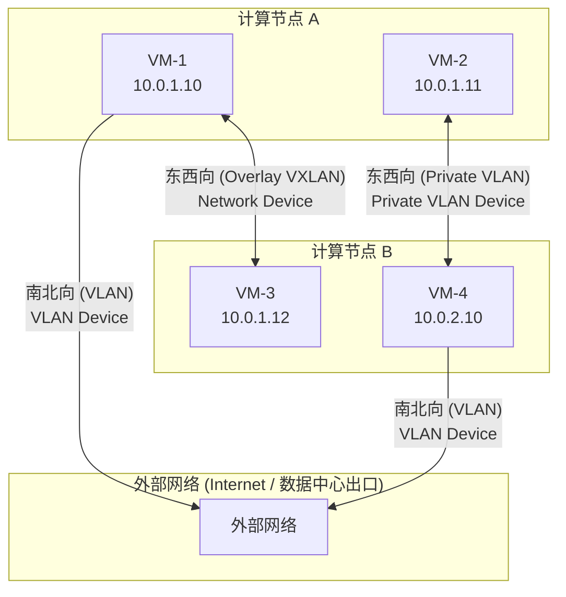

# 添加计算节点

计算节点（Compute Node）负责运行虚拟机工作负载。CloudLand 采用 **计算面裸机部署**，以确保极致的 IO 性能与低延迟虚拟化体验。

---

## 部署流程概览

添加计算节点分为两步：**先注册，再部署**。

```
管理员在 Web UI / API 注册节点 → 系统返回部署命令 → 管理员在计算节点上执行命令
```

系统会自动分配唯一的节点 ID（SCI_CLIENT_ID），并生成包含所有参数的一键部署命令，无需手动拼接。

---

## 准备工作

请确保目标计算节点满足以下条件：

- **CPU 支持硬件虚拟化**：`ls /dev/kvm` 应当有输出。
- **操作系统**：Ubuntu 22.04 LTS。
- **管理网络互通**：可访问控制节点的 `9988` (SCI) 端口。
- **root 权限**：部署脚本需以 root 身份执行。

---

## 第一步：注册计算节点

### 方式一：通过 Web 管理界面（推荐）

1. 以管理员身份登录 Web UI。
2. 进入 **Infrastructure > Hypervisors**（主机管理）页面。
3. 点击 **部署** 按钮，填写以下信息：

| 字段 | 说明 | 默认值 |
| :--- | :--- | :--- |
| IP | 计算节点管理网 IP（必填） | - |
| Hostname | 节点主机名，集群内唯一（必填） | - |
| Network Device | 承载 **VXLAN 隧道和管理通信**的物理网卡（详见下方说明） | `eth0` |
| VLAN Device | 承载 **标准 VLAN 业务流量**的物理网卡（详见下方说明） | 与 Network Device 相同 |
| Private VLAN Device | 承载 **RFC 1918 私有网段 VLAN 流量**的物理网卡（详见下方说明） | 与 VLAN Device 相同 |
| DNS Server | DNS 服务器 | `8.8.8.8` |
| Domain | 域名 | `example.com` |
| Zone | 可用区 | 自动分配默认可用区 |
| Virt Type | 虚拟化类型 | `kvm-x86_64` |

4. 点击确认后，系统将：
   - 创建 Hyper 记录（状态为 **DEPLOYING**）
   - 自动分配唯一的 `SCI_CLIENT_ID`
   - **返回一条部署命令**

5. 点击 **复制** 按钮，将部署命令复制到剪贴板。

### 方式二：通过 REST API

```bash
# 获取管理员 Token
TOKEN=$(curl -sk -X POST https://<PUBLIC_IP>/api/v1/auth/login \
  -H "Content-Type: application/json" \
  -d '{"username":"admin", "password":"<ADMIN_PASSWORD>"}' | jq -r .access_token)

# 注册计算节点
curl -sk -X POST https://<PUBLIC_IP>/api/v1/hypers \
  -H "Authorization: Bearer $TOKEN" \
  -H "Content-Type: application/json" \
  -d '{
    "ip": "192.168.1.10",
    "hostname": "compute-01",
    "network_device": "eth0",
    "vlan_device": "eth0",
    "private_vlan_device": "eth0",
    "virt_type": "kvm-x86_64"
  }'
```

响应中的 `deploy_command` 字段即为需要在计算节点上执行的部署命令：

```json
{
  "hostid": 1,
  "hostname": "compute-01",
  "status": 4,
  "status_name": "deploying",
  "deploy_command": "export CONTROLLER_IP=... HOSTNAME=compute-01 ... ; curl -sSL ... | sudo -E bash"
}
```

---

## 第二步：在计算节点上执行部署命令

SSH 登录到目标计算节点，粘贴并执行上一步获得的部署命令：

```bash
# 示例（实际命令由系统自动生成，请勿手动拼接）
export CONTROLLER_IP=10.0.0.100 HOSTNAME=compute-01 NETWORK_DEVICE=eth0 \
  VLAN_DEVICE=eth0 PRIVATE_VLAN_DEVICE=eth0 DNS_SERVER=8.8.8.8 \
  SCI_CLIENT_ID=1 DOMAIN=example.com ZONE_NAME=zone0 VIRT_TYPE=kvm-x86_64; \
  curl -sSL https://raw.githubusercontent.com/threen134/cloudland/staging/deploy/docker/scripts/deploy-compute-node.sh | sudo -E bash
```

脚本将自动完成：
- 系统配置（时区、主机名、网络）
- 安装 Docker 及相关依赖
- 部署 SCI 计算节点服务
- 配置 libvirt/KVM
- 注册到控制节点（`CONTROLLER_IP:9988`）

> [!IMPORTANT]
> - 部署命令中的所有参数（包括 `SCI_CLIENT_ID`）由系统自动生成，请直接复制执行，**无需手动修改**。
> - 部署完成后，节点状态将从 `DEPLOYING` 自动变为 `ACTIVE`。
> - 如果部署失败（状态变为 `DEPLOY_FAILED`），可以在 Web UI 中重新点击部署，系统会复用相同的 hostid 重新生成命令。

---

## 第三步：验证节点状态

- **Web 管理界面**：进入 **Infrastructure > Hypervisors**，确认节点状态为 **Active**，并显示 CPU、内存、磁盘容量。
- **API 查询**：
  ```bash
  curl -sk -X GET https://<PUBLIC_IP>/api/v1/hypers \
    -H "Authorization: Bearer $TOKEN" | jq .
  ```

---

## 网络设备说明

CloudLand 的计算节点将网络流量按方向分为**东西向**（VM 之间）和**南北向**（VM 到外部），并支持将不同流量绑定到不同的物理网卡，实现隔离。

### 流量模型



### Network Device — 东西向 Overlay（VXLAN）

承载 **VXLAN 隧道封装的东西向流量**（VNI >= 4095）以及 **SCI 管理通信**。这是唯一的必填网卡参数。

- **方向**：东西向（VM ↔ VM 跨节点通信）
- **封装**：VXLAN Overlay，跨三层网络，不依赖物理交换机 VLAN 配置
- 同时承载计算节点与控制节点之间的 SCI 协议通信（9988 端口）
- 对应 `cloudrc.local` 中的 `vxlan_interface`

### VLAN Device — 南北向出口

承载 **标准 802.1Q VLAN 的南北向流量**（VLAN ID < 4095），用于 VM 访问外部网络。

- **方向**：南北向（VM ↔ 外部网络 / Internet）
- **封装**：802.1Q VLAN，需物理交换机配合 trunk 放行对应 VLAN
- 典型场景：弹性公网 IP (EIP)、浮动 IP、NAT 出口
- 不设置时默认使用 Network Device
- 对应 `cloudrc.local` 中的 `vlan_interface`

### Private VLAN Device — 东西向二层（VLAN）

承载 **RFC 1918 私有网段的东西向 VLAN 流量**，是 VXLAN Overlay 之外的另一种东西向方案。

- **方向**：东西向（VM ↔ VM 二层直通）
- **封装**：802.1Q VLAN，依赖物理交换机二层互通
- 仅对以下私有地址段生效：`10.0.0.0/8`、`172.16.0.0/12`、`192.168.0.0/16`
- 相比 VXLAN 少一层封装开销，适合对延迟敏感的内部业务
- 不设置时默认使用 VLAN Device
- 对应 `cloudrc.local` 中的 `private_vlan_interface`

### 对比总结

| | Network Device | VLAN Device | Private VLAN Device |
| :--- | :--- | :--- | :--- |
| **流量方向** | 东西向 | 南北向 | 东西向 |
| **封装方式** | VXLAN Overlay | 802.1Q VLAN | 802.1Q VLAN |
| **VNI/VLAN** | VNI >= 4095 | VLAN ID < 4095 | VLAN ID < 4095（仅私有网段） |
| **交换机依赖** | 无（三层可达即可） | 需 trunk 放行 | 需 trunk 放行 |
| **典型用途** | 租户内部组网 | 公网出口 / EIP | 内部私有互联 |
| **是否必填** | 是 | 否（默认=Network Device） | 否（默认=VLAN Device） |

### 典型部署场景

**场景一：单网卡（测试环境）**

所有流量共用一块网卡：
```
Network Device = eth0
VLAN Device    = eth0（默认）
Private VLAN   = eth0（默认）
```

**场景二：双网卡（东西向/南北向分离）**

Overlay + 私有 VLAN 走管理网，公网出口走独立网卡：
```
Network Device = bond0   ← 东西向 VXLAN + 管理
VLAN Device    = bond1   ← 南北向公网出口
Private VLAN   = bond0   ← 东西向私有 VLAN（跟随管理网）
```

**场景三：三网卡（完全隔离）**

三种流量各自独立出口：
```
Network Device = bond0   ← 东西向 VXLAN + 管理
VLAN Device    = bond1   ← 南北向公网出口
Private VLAN   = bond2   ← 东西向私有 VLAN（独立隔离）
```

> [!TIP]
> 回退链：`Private VLAN Device` → `VLAN Device` → `Network Device`。
> 只有一块网卡时只需填写 Network Device，其余自动继承。

---

## 常见问题

- **节点状态停留在 DEPLOYING**：SSH 到计算节点查看部署脚本输出，确认是否有报错。
- **SCI 通信超时**：检查控制节点的 `9988` 端口是否被防火墙拦截。
- **注册失败（API 返回错误）**：确认 hostname 集群内唯一，且控制面服务已正常运行。
- **KVM 不可用**：进入节点 BIOS，开启 `Virtualization Technology` 支持。
- **部署失败重试**：在 Web UI 重新点击部署即可，系统会复用已分配的 hostid。
