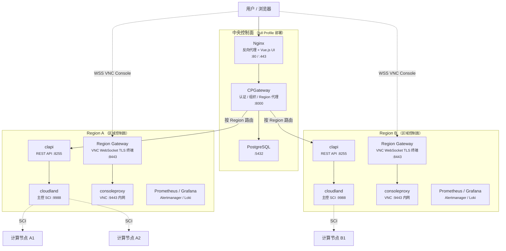

# 部署手册概览

> **CloudLand** 是一款致力于“极致性能、轻量交付”的开源私有云平台。
> 本部署方案通过 Docker 将控制面容器化，在保持计算面裸机性能的同时，极大简化了部署与运维流程。

本手册旨在指导您从零开始搭建、扩展及维护 CloudLand 环境。无论您是进行单机测试，还是构建高可用生产集群，都能在此找到详尽的操作指引。

---

## 快速导航

### 1. 准备阶段
在开始部署前，请确您的基础设施满足基础要求：
- [前置要求](./01-prerequisites.md) — 了解硬件、操作系统及网络的基础配置。

### 2. 开始部署
根据您的业务量级选择合适的部署方式：
- [快速开始（单节点）](./02-quick-start.md) — 适合开发测试或小型规模，支持包含 UI 的全量环境。
- [高可用 (HA) 部署](./03-ha-deployment.md) — 基于 VRRP 和外部数据库实现的生产级主备高可用架构。

### 3. 规模扩展
- [添加计算节点](./04-compute-node.md) — 扩展您的算力池，支持多种虚拟化架构。
- [多区域部署 (Multi-Region)](./05-multi-region.md) — 跨地域的云资源统一管理与水平扩展。

### 4. 进阶配置与运维
- [配置参考](./06-configuration.md) — 环境变量、目录结构及其自定义方法。
- [运维管理](./07-operations.md) — 常用容器指令、故障排查技巧及日常维护流程。

---

## 部署模式说明

CloudLand 通过 `COMPOSE_PROFILES` 环境变量控制启用的组件。四个 Profile 可自由组合：

- **`region`** — 区域控制面（cloudland、clapi、consoleproxy、监控栈）
- **`region-gateway`** — Region 边缘网关（VNC WebSocket TLS 终端，多 Region 远程节点使用）
- **`full`** — 中央控制面（Nginx + CPGateway + Web UI）
- **`dev`** — 本地容器化 PostgreSQL

### 组件总览

> [!NOTE]
> **单 Region 部署**时，中央控制面与区域控制面部署在同一台机器上（即 `COMPOSE_PROFILES=full,dev,region`），VNC Console 通过中央 Nginx 转发。
> **多 Region 部署**时，中央控制面独立部署（`full,dev`），各区域部署核心服务 + 边缘网关（`region,region-gateway`），VNC Console 通过 Region Gateway 在边缘终结 TLS。

### 模式对照

| 模式 | `COMPOSE_PROFILES` | 组件 | 适用场景 |
| :--- | :--- | :--- | :--- |
| **全量单节点** | `full,dev,region` | 中央控制面 + 区域控制面 + 本地 DB | **推荐**。单节点一键部署，开箱即用 |
| **全量 + 外部 DB** | `full,region` | 中央控制面 + 区域控制面 | 生产 HA 部署，使用外部 PostgreSQL |
| **仅中央控制面** | `full,dev` | Nginx + CPGateway + PostgreSQL | 多 Region 架构的中央节点，不运行区域服务 |
| **远程 Region（含 VNC 网关）** | `region,region-gateway` | 区域控制面 + Region Gateway | 远程 Region 节点，含 VNC WebSocket 边缘入口 |
| **仅区域控制面** | `region` | cloudland + clapi + consoleproxy + 监控栈 | 远程 Region 节点，无 VNC 边缘网关 |

> [!TIP]
> Profile 可自由组合：
> - 生产单节点：`full,dev,region`（全量 + 本地 DB）
> - 生产 HA：`full,region`（全量 + 外部 DB）
> - 多 Region 中央节点：`full,dev`（仅中央控制面）
> - 远程 Region：`region,region-gateway`（区域控制面 + VNC 边缘网关）

---

## 我们的目标
我们希望通过这套部署体系，让用户在 **10 分钟内** 完成一套功能完备的私有云搭建，同时保留底层物理特性的最优性能。

如果您在部署过程中遇到任何问题，请参考 [故障排查](./07-operations.md#故障排查) 或前往我们的 [GitHub 项目页](https://github.com/threen134/cloudland) 提交 Issue。
