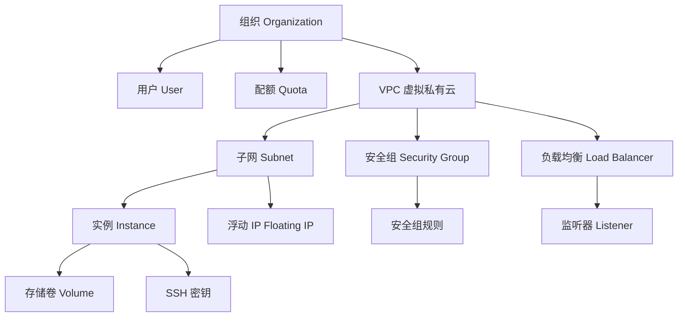
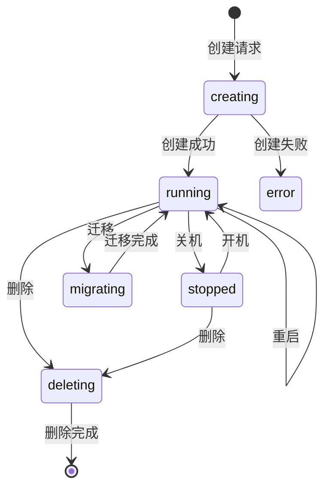

# 核心概念

CloudLand 遵循经典的 IaaS 云平台资源模型，以下是平台中的关键概念和资源关系。

## 资源层次结构

```mermaid
graph TD
    ORG[组织 Organization] --> USER[用户 User]
    ORG --> QUOTA[配额 Quota]
    ORG --> VPC[VPC 虚拟私有云]
    VPC --> SUBNET[子网 Subnet]
    VPC --> SG[安全组 Security Group]
    VPC --> LB[负载均衡 Load Balancer]
    SUBNET --> INST[实例 Instance]
    SUBNET --> FIP[浮动 IP Floating IP]
    INST --> VOL[存储卷 Volume]
    INST --> KEY[SSH 密钥]
    SG --> RULE[安全组规则]
    LB --> LISTENER[监听器 Listener]
```

## 实例状态机

```mermaid
stateDiagram-v2
    [*] --> creating: 创建请求
    creating --> running: 创建成功
    creating --> error: 创建失败
    running --> stopped: 关机
    stopped --> running: 开机
    running --> running: 重启
    running --> migrating: 迁移
    migrating --> running: 迁移完成
    running --> deleting: 删除
    stopped --> deleting: 删除
    deleting --> [*]: 删除完成
```
