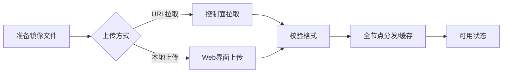

# 镜像管理指南

镜像 (Image) 是创建虚拟机的基础模板。本指南将带您了解如何管理镜像的完整生命周期。

::: tip 快速说明
CloudLand 默认支持 `qcow2` 和 `raw` 格式。建议生产环境使用 `qcow2` 以获得更好的克隆速度和空间利用率。
:::

## 核心流程图

## 镜像基础属性

### 1. 支持的存储格式
不同格式对性能和功能的支持有所差异：
- **qcow2**: 支持写时复制 (COW)、快照和压缩。
- **raw**: 原始格式，无额外特性，但 IO 路径最短，性能最强。
- **ISO**: 用于初次安装系统的光盘镜像。

### 2. 位深度与架构
镜像必须与物理计算节点的 CPU 指令集匹配。
- **x86_64**: 主流 Intel/AMD 处理器支持。
- **ARM64**: 针对国产服务器或 Apple Silicon 架构。

## 权限与可见性策略

### 公共镜像 (Public)
由管理员维护，所有组织、所有用户均可查看并用来创建实例。通常包含标准的 Ubuntu、CentOS 等。

### 组织私有镜像 (Organization)
仅属于特定组织。组织内的成员共享，外部不可见，适合存放含有企业内部业务代码的定制镜像。

## 运维操作指南

### 镜像导入流程
可以通过 API 执行异步拉取任务：
1. **指定源**: HTTP/HTTPS 下载链接。
2. **定义元数据**: 包括镜像名称、最低内存要求、磁盘总大小。
3. **分发策略**: 决定镜像在哪些可用区 (AZ) 可用。

### 镜像的状态说明
| 状态 | 描述 |
|------|------|
| `pending` | 正在拉取或校验中 |
| `active` | 已就绪，可用于创建虚拟机 |
| `error` | 处理失败（通常是格式不支持或下载损坏） |
| `deleting` | 标记删除，正在清理底层存储资源 |
