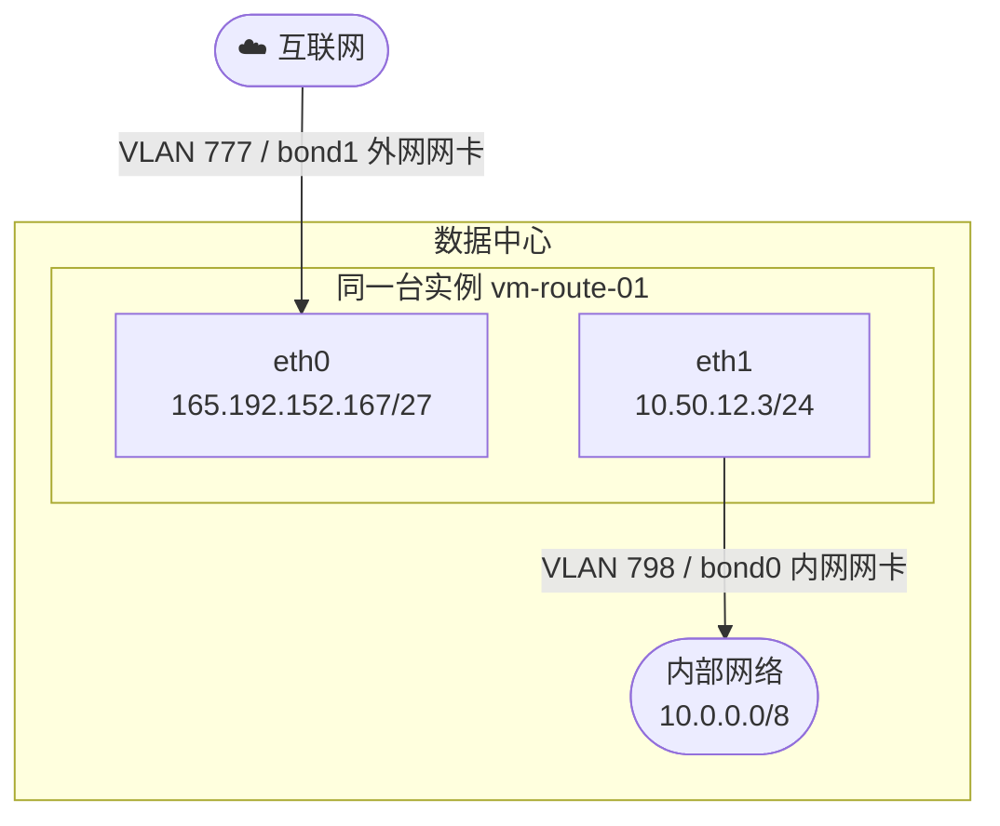

# 双网卡实例与静态路由注入

## 概述

CloudLand 支持为一台实例同时挂载多个网络接口（Multi-NIC），常见场景是主网卡接入**公网子网**（对外暴露服务），辅助网卡接入**私网子网**（访问内部资源），并通过 Cloud-Init 在启动时注入静态路由，使实例能够经由私网网关访问内部网段。

---

## 底层网络原理：VLAN 隔离

CloudLand 的公网子网和私网子网都建立在数据中心的 **VLAN** 之上，两者共享同一套物理网络基础设施，通过 VLAN ID 实现二层隔离。

物理网卡有两种部署方式：

**方式一：单块物理网卡（VLAN trunk）**
所有流量共用同一块物理网卡（或 bond），通过 **VLAN trunk** 在二层隔离公网与内网流量。宿主机上不同 VLAN 的子接口分别桥接给虚拟机的 eth0 和 eth1，流量在同一条物理链路上靠 VLAN tag 区分，互不干扰。

**方式二：两块独立物理网卡（当前部署场景）**
公网与内网各用一块独立的物理网卡（或 bond），物理层面完全隔离，安全性和带宽互不影响：

- **bond1**（外网网卡）：承载公网流量，VLAN 777，虚拟机侧对应 `eth0`
- **bond0**（内网网卡）：承载数据中心内网流量，VLAN 798，虚拟机侧对应 `eth1`

无论哪种方式，从虚拟机视角看到的网络接口（eth0 / eth1）和 VLAN 编号完全一致，CloudLand 的子网配置无需区分底层是单网卡还是双网卡。

```
bond1（外网网卡）                    bond0（内网网卡）
    │                                    │
    ├── VLAN 777  →  pub01               ├── VLAN 798  →  private-subnet
    │   （公网子网 165.192.152.160/27）    │   （私网子网 10.50.12.0/24）
    │                                    ├── VLAN 9805349  →  vpc-subnet-01
    │                                    │   （VPC 子网 192.168.1.0/24）
    │                                    └── ...
```

| 子网类型 | 说明 | 典型用途 |
|---------|------|---------|
| **public** | IP 地址可路由到公网，网关对接 ISP 上行链路 | Web 服务、SSH 入口 |
| **private** | IP 地址仅在数据中心内部可达，不经过 NAT | 存储、数据库、内部服务互联 |
| **vpc（internal）** | 租户私有二层，VPC 内跨子网通过 VPC 路由 | 微服务、多层架构 |

> **重要**：每个接口使用不同的 VLAN，同一实例的两个接口不能绑定同一 VLAN（系统会校验冲突）。

---

## 典型架构

eth0 与 eth1 是平级的两个独立接口，分别连接到不同的物理网卡和 VLAN。eth0 服务于外网应用，eth1 连接内网网络，两个接口通过不同的 VLAN 连接到数据中心网络，实例通过 Cloud-Init 注入静态路由实现双网卡互不干扰的访问路径。



- **eth0** 默认路由：`0.0.0.0/0 via 165.192.152.161`
- **eth1** 静态路由：`10.0.0.0/8 via 10.50.12.1`（由 Cloud-Init 注入）

实例默认路由走公网接口（eth0），内部大网段 `10.0.0.0/8` 通过私网网关（`10.50.12.1`）路由，两个方向互不干扰。

---

## 通过 Web 控制台创建

### 步骤一：进入创建实例页面

在控制台左侧导航栏选择 **实例** → 点击右上角 **创建实例**。

### 步骤二：填写基本信息

| 字段 | 示例值 |
|------|--------|
| 主机名 | `my-server-01` |
| 镜像 | Ubuntu 22.04 |
| 规格 | 根据需求选择合适规格，如 2 核 / 4 GB |
| 可用区 | 选择离业务最近的可用区 |
| SSH 密钥 | 选择已上传的密钥，或在此之前先创建密钥 |
| 密码 | 设置高强度密码，建议 12 位以上，包含大小写字母、数字和特殊字符 |

### 步骤三：配置主网卡（公网接口）

在 **网络类型** 中选择 `public`，然后选择公网子网：

- **子网**：`pub01`（165.192.152.160/27）

### 步骤四：添加辅助网卡（私网接口）

点击 **添加辅助接口**，网络类型选择 `private`：

- **子网**：`private-subnet`（10.50.12.0/24）

### 步骤五：填写 Cloud-Init 脚本（注入路由）

展开 **高级设置**，在 **用户数据 (Cloud-Init Script)** 中填写以下内容，类型选 `plain`：

```yaml
#cloud-config

write_files:
  - path: /etc/systemd/system/custom-routes.service
    content: |
      [Unit]
      Description=Custom Static Routes
      After=network-online.target
      Wants=network-online.target

      [Service]
      Type=oneshot
      ExecStart=/sbin/ip route add 10.0.0.0/8 via 10.50.12.1
      RemainAfterExit=yes

      [Install]
      WantedBy=multi-user.target

runcmd:
  - systemctl daemon-reload
  - systemctl enable custom-routes.service
  - systemctl start custom-routes.service
```

> `10.50.12.1` 是 `private-subnet` 的网关地址，`10.0.0.0/8` 是需要经由私网路由的目标网段，请根据实际情况替换。

### 步骤六：点击创建

确认配置后点击 **创建实例**，等待状态变为 `running`。

---

## 通过 API 创建

### 前置步骤：获取 Token

```bash
# 1. 登录获取 access_token
TOKEN=$(curl -sk https://<your-host>/api/v1/auth/token \
  -X POST \
  -H "Content-Type: application/json" \
  -d '{"username": "admin@local.com", "password": "<password>"}' \
  | jq -r '.access_token')

# 2. 切换到目标 Region（获取带 region 上下文的 token）
TOKEN=$(curl -sk https://<your-host>/api/v1/auth/switch-region \
  -X POST \
  -H "Authorization: Bearer $TOKEN" \
  -H "Content-Type: application/json" \
  -d '{"region": "<region-uuid>"}' \
  | jq -r '.access_token')
```

### 查询所需资源 ID

```bash
# 查询子网列表（获取 public 和 private 子网 ID）
curl -sk "https://<your-host>/api/v1/subnets?page=1&page_size=50" \
  -H "Authorization: Bearer $TOKEN" \
  | jq '.subnets[] | {id, name, network, type, gateway}'

# 查询镜像列表
curl -sk "https://<your-host>/api/v1/images?page=1&page_size=20" \
  -H "Authorization: Bearer $TOKEN" \
  | jq '.images[] | {id, name, status}'

# 查询 SSH 密钥列表
curl -sk "https://<your-host>/api/v1/keys?page=1&page_size=20" \
  -H "Authorization: Bearer $TOKEN" \
  | jq '.keys[] | {id, name}'
```

### 创建实例请求

```bash
USERDATA='#cloud-config

write_files:
  - path: /etc/systemd/system/custom-routes.service
    content: |
      [Unit]
      Description=Custom Static Routes
      After=network-online.target
      Wants=network-online.target

      [Service]
      Type=oneshot
      ExecStart=/sbin/ip route add 10.0.0.0/8 via 10.50.12.1
      RemainAfterExit=yes

      [Install]
      WantedBy=multi-user.target

runcmd:
  - systemctl daemon-reload
  - systemctl enable custom-routes.service
  - systemctl start custom-routes.service'

curl -sk https://<your-host>/api/v1/instances \
  -X POST \
  -H "Authorization: Bearer $TOKEN" \
  -H "Content-Type: application/json" \
  -d "$(jq -n \
    --arg userdata "$USERDATA" \
    '{
      hostname: "vm-route-01",
      image: { id: "<image-uuid>" },
      flavor: "M1",
      zone: "zone01",
      count: 1,
      primary_interface: {
        subnet: { id: "<public-subnet-uuid>" },
        security_groups: []
      },
      secondary_interfaces: [
        {
          subnet: { id: "<private-subnet-uuid>" },
          security_groups: []
        }
      ],
      nested_enable: false,
      userdata_type: "plain",
      userdata: $userdata,
      login_port: 22,
      root_passwd: "Lab4man1",
      keys: [{ id: "<key-uuid>" }]
    }')"
```

### 请求参数说明

| 参数 | 类型 | 说明 |
|------|------|------|
| `hostname` | string | 实例主机名 |
| `image.id` | string | 镜像 UUID |
| `flavor` | string | 规格名称（如 `M1`），非 UUID |
| `zone` | string | 可用区名称 |
| `count` | int | 批量创建数量，最大 16 |
| `primary_interface.subnet.id` | string | 主网卡绑定的子网 UUID（public 类型） |
| `secondary_interfaces[].subnet.id` | string | 辅助网卡绑定的子网 UUID（private 类型） |
| `userdata_type` | string | `plain`（明文）或 `base64`（Base64 编码） |
| `userdata` | string | Cloud-Init 脚本内容 |
| `root_passwd` | string | root 密码 |
| `keys[].id` | string | SSH 密钥 UUID，可多个 |

### 成功响应示例

```json
[
  {
    "id": "dce721c5-5b63-4642-944a-c20e3010fe13",
    "hostname": "vm-route-01",
    "status": "provisioning",
    "interfaces": [
      {
        "name": "eth0",
        "ip_address": "165.192.152.167/27",
        "subnet": { "name": "pub01" },
        "is_primary": true
      },
      {
        "name": "eth1",
        "ip_address": "10.50.12.3/24",
        "subnet": { "name": "private-subnet" },
        "is_primary": false
      }
    ]
  }
]
```

---

## 验证路由注入结果

实例变为 `running` 后，SSH 登录验证：

```bash
ssh root@165.192.152.167

# 查看路由表
ip route show

# 预期包含以下条目：
# default via 165.192.152.161 dev eth0
# 10.0.0.0/8 via 10.50.12.1 dev eth1   ← Cloud-Init 注入的静态路由
# 10.50.12.0/24 dev eth1 proto kernel

# 验证私网网关可达
ping -c 3 10.50.12.1

# 验证 systemd 服务状态
systemctl status custom-routes.service
```

---

## 常见问题

**Q：两个接口可以使用同一个子网吗？**

不可以。同一实例的多个接口必须绑定不同 VLAN 的子网，系统会在创建时检测 VLAN 冲突并报错。

**Q：Cloud-Init 脚本只在首次启动时执行，重启后路由会消失吗？**

不会。示例中使用 systemd service 持久化路由，每次开机都会执行 `ip route add`。如果手动执行 `runcmd` 中的临时命令则只对当次启动有效。

**Q：`flavor` 字段填 UUID 还是名称？**

填**名称**（如 `M1`），不是 UUID。这与其他资源（image、subnet 用 UUID）不同，请注意区分。

**Q：私网子网没有公网网关，实例能访问互联网吗？**

可以，出口流量走主网卡（eth0，公网子网）的默认路由。私网接口（eth1）仅用于访问数据中心内部的 `10.0.0.0/8` 等私有网段，两条路径互不影响。
